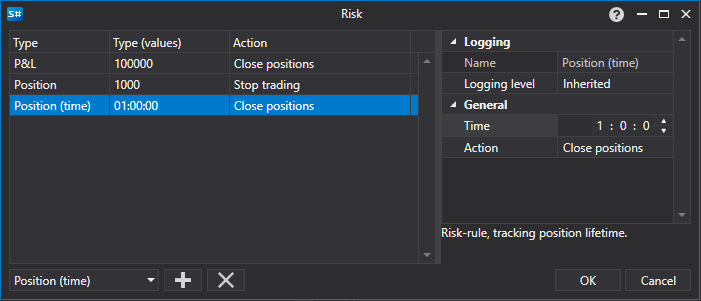

# 风险设置窗口

[AlertSettingsWindow](xref:StockSharp.Alerts.AlertSettingsWindow) - 一个用于配置风险控制的特殊窗口。



以下是调用策略风险控制设置窗口的代码示例。

```cs
		private void RiskButton_OnClick(object sender, RoutedEventArgs e)
		{
			var wnd = new RiskWindow();
			wnd.Rules.AddRange(Strategy.RiskManager.Rules.Select(r => r.Clone()));
			if (!wnd.ShowModal(this))
				return;
			Strategy.RiskManager.Rules.Clear();
			Strategy.RiskManager.Rules.AddRange(wnd.Rules);
		}
	  				
```
