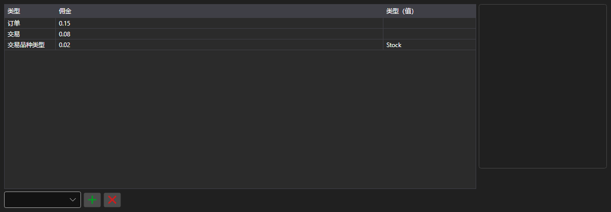

# 佣金规则



[CommissionPanel](xref:StockSharp.Xaml.CommissionPanel) - 佣金规则表格。每一行都是一条 [ICommissionRule](xref:StockSharp.Algo.Commissions.ICommissionRule) 规则：按成交笔数、按数量、按成交额或按金额百分比计费。

**主要属性**

- [CommissionPanel.Rules](xref:StockSharp.Xaml.CommissionPanel.Rules) - 佣金规则列表。

表格中的规则会传给佣金管理器，因此历史回测计算成本的方式与实盘一致。

下面是其使用的代码片段:

```xaml
<Window x:Class="Sample.CommissionWindow"
	xmlns="http://schemas.microsoft.com/winfx/2006/xaml/presentation"
	xmlns:x="http://schemas.microsoft.com/winfx/2006/xaml"
	xmlns:xaml="http://schemas.stocksharp.com/xaml"
	Height="300" Width="700">
	<xaml:CommissionPanel x:Name="CommissionPanel" />
</Window>
```

```cs
// 每笔成交的佣金
CommissionPanel.Rules.Add(new CommissionPerTradeRule { Value = 1.5m });

// 按订单数量计算的佣金
CommissionPanel.Rules.Add(new CommissionPerOrderVolumeRule { Value = 0.01m });

// 把规则应用到佣金管理器
_connector.CommissionManager.Rules.Clear();
_connector.CommissionManager.Rules.AddRange(CommissionPanel.Rules);
```

## 另请参阅

[服务面板](../service_panels.md)
