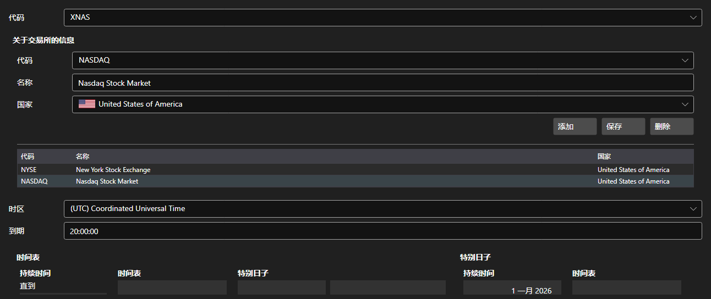

# 交易板块



[ExchangeBoardsPanel](xref:StockSharp.Xaml.ExchangeBoardsPanel) - [ExchangeBoard](xref:StockSharp.BusinessEntities.ExchangeBoard) 交易板块目录。每个板块都要设置代码、所属交易所、时区和运行时间表。

**主要属性**

- [ExchangeBoardsPanel.Boards](xref:StockSharp.Xaml.ExchangeBoardsPanel.Boards) - 板块列表。
- [ExchangeBoardsPanel.SelectedBoardCode](xref:StockSharp.Xaml.ExchangeBoardsPanel.SelectedBoardCode) - 所选板块的代码。

时间表通过内嵌的 [WorkingTimeControl](xref:StockSharp.Xaml.WorkingTimeControl) 编辑。历史回测正是根据这张时间表判断板块何时开市、何时休市。

下面是其使用的代码片段:

```xaml
<Window x:Class="Sample.BoardsWindow"
	xmlns="http://schemas.microsoft.com/winfx/2006/xaml/presentation"
	xmlns:x="http://schemas.microsoft.com/winfx/2006/xaml"
	xmlns:xaml="http://schemas.stocksharp.com/xaml"
	Height="500" Width="800">
	<xaml:ExchangeBoardsPanel x:Name="BoardsPanel" />
</Window>
```

```cs
// 选择板块
BoardsPanel.SetBoardCode(ExchangeBoard.MicexTqbr.Code);

// 标记目录已被修改
BoardsPanel.Changed += () => _isModified = true;

// 保存板块
foreach (var board in BoardsPanel.Boards)
	_exchangeInfoProvider.Save(board);
```

## 另请参阅

[服务面板](../service_panels.md)
