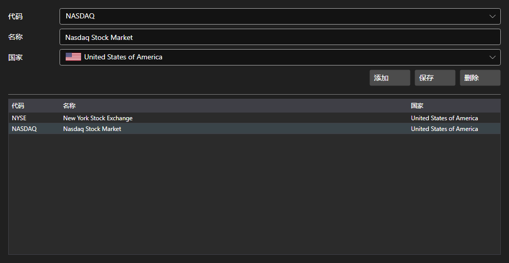

# 交易所



[ExchangesPanel](xref:StockSharp.Xaml.ExchangesPanel) - 交易所目录。显示带名称和国家的 [Exchange](xref:StockSharp.BusinessEntities.Exchange) 列表，并允许添加自定义交易所。

**主要属性**

- [ExchangesPanel.Exchanges](xref:StockSharp.Xaml.ExchangesPanel.Exchanges) - 交易所 [Exchange](xref:StockSharp.BusinessEntities.Exchange) 列表。
- [ExchangesPanel.SelectedExchangeName](xref:StockSharp.Xaml.ExchangesPanel.SelectedExchangeName) - 所选交易所的名称。

该面板通常与 [ExchangeBoardsPanel](xref:StockSharp.Xaml.ExchangeBoardsPanel) 搭配使用：在这里选择的交易所决定了那边显示哪些板块。选择变化时会触发 `SelectedExchangeChanged` 事件。

下面是其使用的代码片段:

```xaml
<Window x:Class="Sample.ExchangesWindow"
	xmlns="http://schemas.microsoft.com/winfx/2006/xaml/presentation"
	xmlns:x="http://schemas.microsoft.com/winfx/2006/xaml"
	xmlns:xaml="http://schemas.stocksharp.com/xaml"
	Height="400" Width="600">
	<xaml:ExchangesPanel x:Name="ExchangesPanel" />
</Window>
```

```cs
// 选择交易所
ExchangesPanel.SetExchange(Exchange.Moex.Name);

// 交易所变化时重置板块选择
ExchangesPanel.SelectedExchangeChanged += () =>
	BoardsPanel.SetBoardCode(null);

// 保存目录
foreach (var exchange in ExchangesPanel.Exchanges)
	_exchangeInfoProvider.Save(exchange);
```

## 另请参阅

[服务面板](../service_panels.md)
