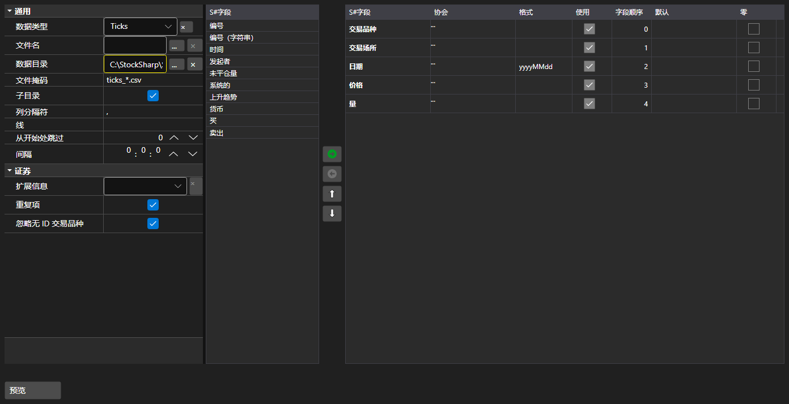

# 导入设置



[ImportSettingsPanel](xref:StockSharp.Xaml.ImportSettingsPanel) - 用于配置从文本文件导入数据的面板。设置分隔符、日期时间格式、编码，最重要的是列的组成与顺序。

**主要属性**

- [ImportSettingsPanel.Settings](xref:StockSharp.Xaml.ImportSettingsPanel.Settings) - 导入设置。
- [ImportSettingsPanel.SelectedFields](xref:StockSharp.Xaml.ImportSettingsPanel.SelectedFields) - 按文件中出现顺序排列的已选字段。
- [ImportSettingsPanel.UnSelectedFields](xref:StockSharp.Xaml.ImportSettingsPanel.UnSelectedFields) - 文件中不包含的字段。

字段在两个列表之间移动，并上下调整顺序，直到与文件中的列顺序一致。[ImportSettingsPanel.HasErrors](xref:StockSharp.Xaml.ImportSettingsPanel.HasErrors) 方法会在导入开始前校验设置。

下面是其使用的代码片段:

```xaml
<Window x:Class="Sample.ImportWindow"
	xmlns="http://schemas.microsoft.com/winfx/2006/xaml/presentation"
	xmlns:x="http://schemas.microsoft.com/winfx/2006/xaml"
	xmlns:xaml="http://schemas.stocksharp.com/xaml"
	Height="600" Width="900">
	<xaml:ImportSettingsPanel x:Name="ImportPanel" />
</Window>
```

```cs
// 配置逐笔数据的导入
ImportPanel.Settings = new ImportSettings(DataType.Ticks, fields);

// 设置有误时不启动导入
if (ImportPanel.HasErrors())
	return;

// 根据配置好的字段创建解析器
var parser = new CsvParser(ImportPanel.Settings.DataType, ImportPanel.SelectedFields);
```

## 另请参阅

[服务面板](../service_panels.md)
