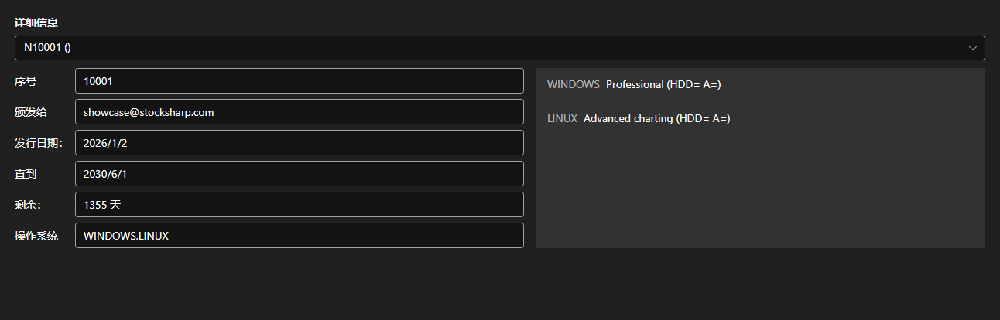

# 许可证



[LicensePanel](xref:StockSharp.Xaml.LicensePanel) - 已安装许可证的面板。在上方列表中选择许可证后，下方显示它的编号、颁发对象、颁发与到期日期、剩余天数和支持的操作系统，右侧列出它允许使用的功能。

**主要属性**

- [LicensePanel.Licenses](xref:StockSharp.Xaml.LicensePanel.Licenses) - 许可证列表。

该面板嵌入在“关于”窗口和首次启动向导中，可以一眼看出哪张许可证即将到期、缺少哪些功能。

下面是其使用的代码片段:

```xaml
<Window x:Class="Sample.LicenseWindow"
	xmlns="http://schemas.microsoft.com/winfx/2006/xaml/presentation"
	xmlns:x="http://schemas.microsoft.com/winfx/2006/xaml"
	xmlns:xaml="http://schemas.stocksharp.com/xaml"
	Height="400" Width="800">
	<xaml:LicensePanel x:Name="LicensePanel" />
</Window>
```

```cs
// 显示已安装的许可证
LicensePanel.Licenses = LicenseHelper.Licenses;
```

## 另请参阅

[服务面板](../service_panels.md)
