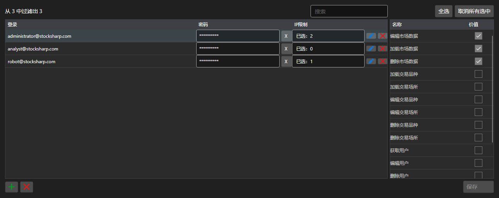

# 账户与权限



[PermissionCredentialsPanel](xref:StockSharp.Xaml.PermissionCredentialsPanel) - 带访问权限的服务器账户表格。对每条记录标明允许哪些操作：下载数据、编辑、下单、管理服务器。

**主要属性**

- [PermissionCredentialsPanel.Credentials](xref:StockSharp.Xaml.PermissionCredentialsPanel.Credentials) - 账户列表。
- [PermissionCredentialsPanel.ChangedCredentials](xref:StockSharp.Xaml.PermissionCredentialsPanel.ChangedCredentials) - 自上次保存以来被修改的记录。
- [PermissionCredentialsPanel.SaveText](xref:StockSharp.Xaml.PermissionCredentialsPanel.SaveText) - 保存按钮上的文字。

面板不会自行保存记录：按下按钮时触发 `Saving` 事件，应用程序写入被修改的账户并调用 [PermissionCredentialsPanel.MarkSaved](xref:StockSharp.Xaml.PermissionCredentialsPanel.MarkSaved)，之后修改列表被清空。

下面是其使用的代码片段:

```xaml
<Window x:Class="Sample.CredentialsWindow"
	xmlns="http://schemas.microsoft.com/winfx/2006/xaml/presentation"
	xmlns:x="http://schemas.microsoft.com/winfx/2006/xaml"
	xmlns:xaml="http://schemas.stocksharp.com/xaml"
	Height="500" Width="900">
	<xaml:PermissionCredentialsPanel x:Name="CredentialsPanel" />
</Window>
```

```cs
// 显示服务器账户
CredentialsPanel.Credentials.AddRange(_server.Credentials);

// 只保存被修改的记录
CredentialsPanel.Saving += () =>
{
	foreach (var credentials in CredentialsPanel.ChangedCredentials)
		_server.Save(credentials);

	// 清空修改列表
	CredentialsPanel.MarkSaved();
};
```

## 另请参阅

[服务面板](../service_panels.md)
