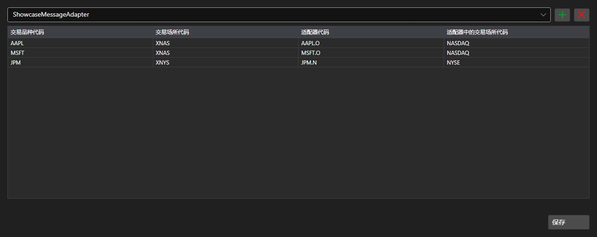

# 标的代码映射



[SecurityMappingPanel](xref:StockSharp.Xaml.SecurityMappingPanel) - 系统内标的代码与特定连接器中代码之间的对应表。它解决了一个常见问题：同一份合约在不同数据提供方那里名称各不相同。

**主要属性**

- [SecurityMappingPanel.ConnectorsInfo](xref:StockSharp.Xaml.SecurityMappingPanel.ConnectorsInfo) - 需要设置映射的连接器列表。
- [SecurityMappingPanel.Storage](xref:StockSharp.Xaml.SecurityMappingPanel.Storage) - 映射的存储。
- [SecurityMappingPanel.SaveText](xref:StockSharp.Xaml.SecurityMappingPanel.SaveText) - 保存按钮上的文字。

行可以直接在表格中添加和删除，按下保存按钮会触发 `Saving` 事件——应用程序把修改写入存储并更改按钮文字。

下面是其使用的代码片段:

```xaml
<Window x:Class="Sample.MappingWindow"
	xmlns="http://schemas.microsoft.com/winfx/2006/xaml/presentation"
	xmlns:x="http://schemas.microsoft.com/winfx/2006/xaml"
	xmlns:xaml="http://schemas.stocksharp.com/xaml"
	Height="500" Width="900">
	<xaml:SecurityMappingPanel x:Name="MappingPanel" />
</Window>
```

```cs
// 设置映射存储
MappingPanel.Storage = _securityMappingStorage;

// 把连接器加入列表
MappingPanel.ConnectorsInfo.Add(new ConnectorInfo("Binance"));

// 通过按钮文字确认保存
MappingPanel.Saving += () => MappingPanel.SaveText = LocalizedStrings.Saved;
```

## 另请参阅

[服务面板](../service_panels.md)
