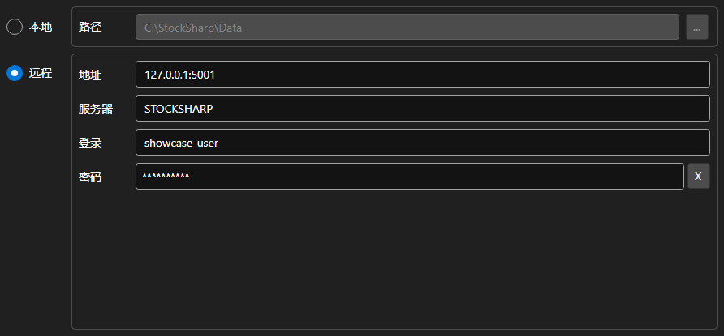

# 存储设置



[StorageSettingsPanel](xref:StockSharp.Xaml.StorageSettingsPanel) - 用于选择行情数据存储位置的面板。可在本地目录与远程服务器之间切换，并设置所选方式的参数。

**主要属性**

- [StorageSettingsPanel.IsLocal](xref:StockSharp.Xaml.StorageSettingsPanel.IsLocal) - 是否使用本地存储。
- [StorageSettingsPanel.Path](xref:StockSharp.Xaml.StorageSettingsPanel.Path) - 本地存储的目录路径。
- [StorageSettingsPanel.Address](xref:StockSharp.Xaml.StorageSettingsPanel.Address) - 远程服务器地址。
- [StorageSettingsPanel.Login](xref:StockSharp.Xaml.StorageSettingsPanel.Login) - 远程服务器的用户名。
- [StorageSettingsPanel.IsCredentialsEnabled](xref:StockSharp.Xaml.StorageSettingsPanel.IsCredentialsEnabled) - 登录名和密码字段是否可用。

任何修改都会触发 `SettingsChanged` 事件，应用程序据此重新创建 [IMarketDataDrive](xref:StockSharp.Algo.Storages.IMarketDataDrive)。

下面是其使用的代码片段:

```xaml
<Window x:Class="Sample.StorageWindow"
	xmlns="http://schemas.microsoft.com/winfx/2006/xaml/presentation"
	xmlns:x="http://schemas.microsoft.com/winfx/2006/xaml"
	xmlns:xaml="http://schemas.stocksharp.com/xaml"
	Height="300" Width="500">
	<xaml:StorageSettingsPanel x:Name="StoragePanel" />
</Window>
```

```cs
// 选择本地目录
StoragePanel.IsLocal = true;
StoragePanel.Path = @"C:\Data";

// 标记设置已被修改
StoragePanel.SettingsChanged += () => _isModified = true;

// 根据面板设置创建存储
var drive = StoragePanel.IsLocal
	? new LocalMarketDataDrive(StoragePanel.Path)
	: (IMarketDataDrive)new RemoteMarketDataDrive(StoragePanel.Address.To<EndPoint>());
```

## 另请参阅

[服务面板](../service_panels.md)
