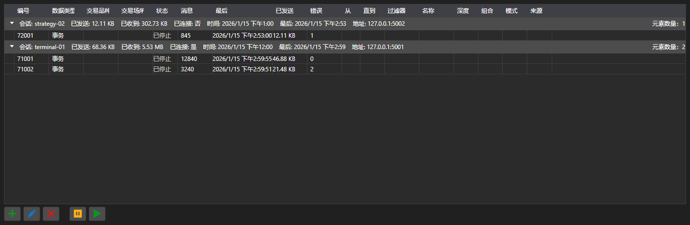

# 订阅



[SubscriptionPanel](xref:StockSharp.Xaml.SubscriptionPanel) - 按会话分组的活动订阅表格。对每个订阅显示数据类型、消息数量、最后一条消息的时间、错误数量以及传输的数据量。

**主要属性**

- [SubscriptionPanel.Subscriptions](xref:StockSharp.Xaml.SubscriptionPanel.Subscriptions) - 订阅列表。
- [SubscriptionPanel.Sessions](xref:StockSharp.Xaml.SubscriptionPanel.Sessions) - 会话列表。
- [SubscriptionPanel.SelectedSubscriptions](xref:StockSharp.Xaml.SubscriptionPanel.SelectedSubscriptions) - 选中的订阅。

该面板用于服务端：可以看到谁已连接、请求了什么、接收了多少数据。对行执行的添加、修改、删除、暂停操作会触发同名事件，具体处理由应用程序完成。

下面是其使用的代码片段:

```xaml
<Window x:Class="Sample.SubscriptionsWindow"
	xmlns="http://schemas.microsoft.com/winfx/2006/xaml/presentation"
	xmlns:x="http://schemas.microsoft.com/winfx/2006/xaml"
	xmlns:xaml="http://schemas.stocksharp.com/xaml"
	Height="400" Width="1000">
	<xaml:SubscriptionPanel x:Name="SubscriptionPanel" />
</Window>
```

```cs
// 注册客户端会话
SubscriptionPanel.AddSession(sessionId, new SessionInfo(sessionId, DateTime.UtcNow, address));

// 把订阅添加到表格
SubscriptionPanel.Subscriptions.Add(new SubscriptionInfo(session, subscription));

// 按表格中的指令取消订阅
SubscriptionPanel.SubscriptionRemoving += info => _connector.UnSubscribe(info.Subscription);
```

## 另请参阅

[服务面板](../service_panels.md)
