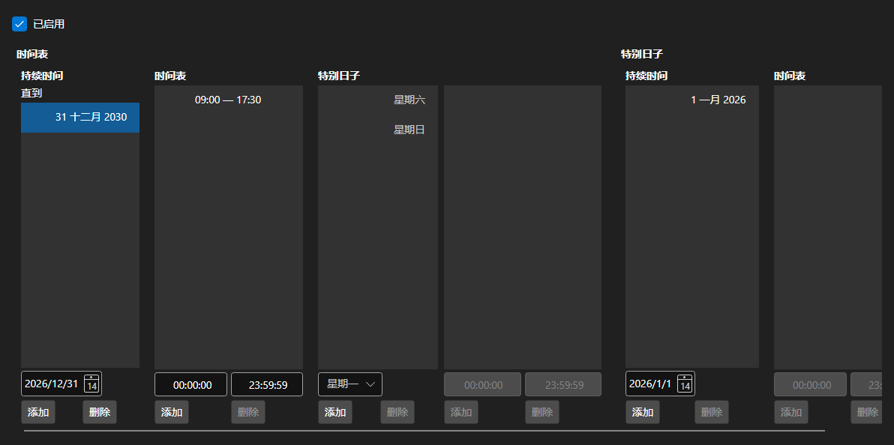

# 运行时间表



[WorkingTimeControl](xref:StockSharp.Xaml.WorkingTimeControl) - [WorkingTime](xref:StockSharp.Messages.WorkingTime) 时间表的编辑器。用于设置时间表的有效期间、按星期几划分的营业时间，以及节假日和调休等特殊日期。

**主要属性**

- [WorkingTimeControl.WorkingTime](xref:StockSharp.Xaml.WorkingTimeControl.WorkingTime) - 正在编辑的时间表。
- [WorkingTimeControl.ShowActive](xref:StockSharp.Xaml.WorkingTimeControl.ShowActive) - 是否标示当前生效的期间。

时间表由若干期间组成，每个期间都有各自按星期几划分的营业时间。时间以区间列表的形式编辑，区间重叠、结束早于开始等错误会通过 `Error` 事件报告。

下面是其使用的代码片段:

```xaml
<Window x:Class="Sample.WorkingTimeWindow"
	xmlns="http://schemas.microsoft.com/winfx/2006/xaml/presentation"
	xmlns:x="http://schemas.microsoft.com/winfx/2006/xaml"
	xmlns:xaml="http://schemas.stocksharp.com/xaml"
	Height="500" Width="700">
	<xaml:WorkingTimeControl x:Name="WorkingTimeControl" />
</Window>
```

```cs
// 显示板块的时间表
WorkingTimeControl.WorkingTime = ExchangeBoard.MicexTqbr.WorkingTime;

// 在编辑器旁显示错误
WorkingTimeControl.Error += (message, isError) => ShowStatus(message, isError);

// 标记时间表已被修改
WorkingTimeControl.DataChanged += () => _isModified = true;
```

## 另请参阅

[服务面板](../service_panels.md)
