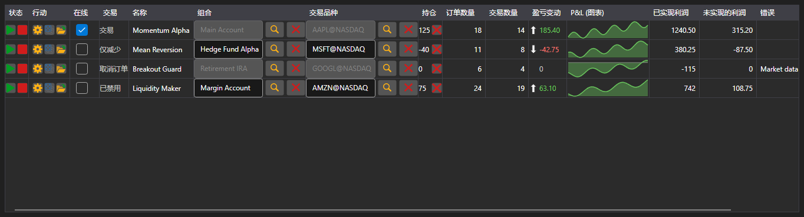

# 策略监控台



[StrategiesDashboard](xref:StockSharp.Xaml.StrategiesDashboard) - 同时运行的策略列表。一行显示标的、投资组合、状态、持仓、盈亏、订单与成交数量以及控制按钮。

**主要属性**

- [StrategiesDashboard.Items](xref:StockSharp.Xaml.StrategiesDashboard.Items) - 监控台的行列表。
- [StrategiesDashboard.SecurityProvider](xref:StockSharp.Xaml.StrategiesDashboard.SecurityProvider) - 标的列使用的标的提供者。
- [StrategiesDashboard.Portfolios](xref:StockSharp.Xaml.StrategiesDashboard.Portfolios) - 投资组合列使用的投资组合来源。

监控台的行是 [IStrategiesDashboardItem](xref:StockSharp.Xaml.IStrategiesDashboardItem)，而不是策略本身：启动、停止、平仓、设置和风险规则按钮都通过该接口的命令工作。因此监控台既适用于本地策略，也适用于运行在服务器上的策略。

下面是其使用的代码片段:

```xaml
<Window x:Class="Sample.DashboardWindow"
	xmlns="http://schemas.microsoft.com/winfx/2006/xaml/presentation"
	xmlns:x="http://schemas.microsoft.com/winfx/2006/xaml"
	xmlns:xaml="http://schemas.stocksharp.com/xaml"
	Height="400" Width="1100">
	<xaml:StrategiesDashboard x:Name="Dashboard" />
</Window>
```

```cs
// 设置标的列和投资组合列的数据源
Dashboard.SecurityProvider = _connector;
Dashboard.Portfolios = new PortfolioDataSource(_connector);

// 为自己的策略添加监控台行
foreach (var strategy in _strategies)
	Dashboard.Items.Add(new StrategyDashboardItem(strategy));

// 把已停止的策略从监控台移除
Dashboard.Items.Remove(Dashboard.Items.First(i => i.ProcessState == ProcessStates.Stopped));
```

## 另请参阅

[策略](../strategies.md)
