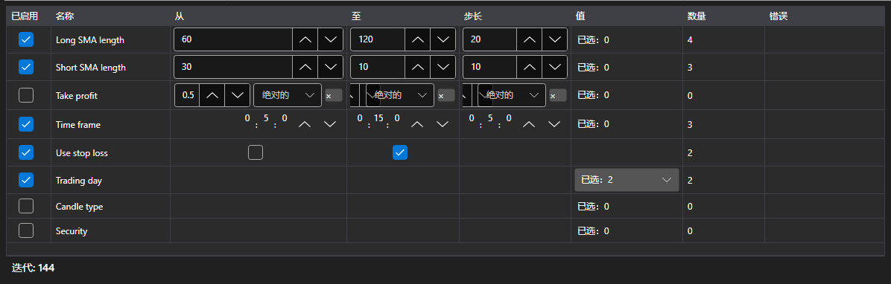

# 优化参数



[OptimizationParametersPanel](xref:StockSharp.Xaml.OptimizationParametersPanel) \- 用于设置遍历所依据的参数的编辑器。一行对应策略的一个参数：勾选框把它纳入遍历，后面是边界和步长或者取值列表，表格下方是汇总：当前这组设置会产生多少次运行。

**主要属性**

- [OptimizationParametersPanel.Parameters](xref:StockSharp.Xaml.OptimizationParametersPanel.Parameters) \- 编辑器的行。任何 [IOptimizationParameterRow](xref:StockSharp.Xaml.IOptimizationParameterRow) 集合都适用，因此每个应用程序都可以有自己的参数模型。
- [OptimizationParametersPanel.MaxIterations](xref:StockSharp.Xaml.OptimizationParametersPanel.MaxIterations) \- 运行次数的上限；零表示没有限制。
- [OptimizationParametersPanel.TotalCount](xref:StockSharp.Xaml.OptimizationParametersPanel.TotalCount) \- 当前这组设置会产生多少次运行：所有已纳入参数的取值个数之积，再按上限截断。
- [OptimizationParametersPanel.FirstProblem](xref:StockSharp.Xaml.OptimizationParametersPanel.FirstProblem) \- 这组设置无法启动的第一个原因。

取值集合取决于参数的类型：数字和 [TimeSpan](xref:System.TimeSpan) 是边界和步长，[bool](xref:System.Boolean) \- 两个取值，枚举、[Security](xref:StockSharp.BusinessEntities.Security) 和 [DataType](xref:StockSharp.Messages.DataType) \- 明确的列表。无法遍历的行（步长为零、未设定边界、列表为空）会直接在表格中说明原因，而汇总计数器不会把这样的行计算在内。

运行次数是按乘积增长的，而不是按求和：三个参数各五个取值就是 125 次运行，而不是 15 次。因此计数器就放在表格旁边，而不是放在向导的下一步。

下面是其使用的代码片段:

```xaml
<Window x:Class="Sample.OptimizationWindow"
	xmlns="http://schemas.microsoft.com/winfx/2006/xaml/presentation"
	xmlns:x="http://schemas.microsoft.com/winfx/2006/xaml"
	xmlns:xaml="http://schemas.stocksharp.com/xaml"
	Height="400" Width="700">
	<xaml:OptimizationParametersPanel x:Name="ParametersPanel" />
</Window>
```

```cs
// 编辑器的行是应用程序自己的模型，实现了 IOptimizationParameterRow
ParametersPanel.Parameters = _rows;

// 运行次数的上限
ParametersPanel.MaxIterations = 5000;

// 当这组设置非空且其中没有错误时即可启动
StartButton.IsEnabled = ParametersPanel.TotalCount > 0 && ParametersPanel.FirstProblem.Length == 0;
```

## 另请参阅

[策略](../strategies.md)

[优化结果](optimization_results.md)
