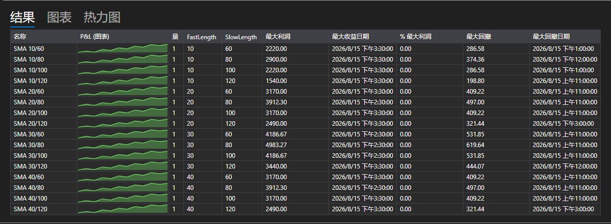

# 优化结果



[OptimizationResultsPanel](xref:StockSharp.Xaml.Charting.OptimizationResultsPanel) \- 把解读遍历结果的三种方式集中在一个控件中：

- **结果** \- 运行表格：参数取值、统计数据，以及每次运行的盈亏曲线就在它的数字旁边。这是 [StrategiesStatisticsPanel](xref:StockSharp.Xaml.StrategiesStatisticsPanel)，因此列的排序和设置方式与其他地方完全相同。
- **图表** \- 按两个参数绘制的三维曲面：坐标轴通过图表上方的列表选择，高度是所选的统计指标。
- **热力图** \- 同一曲面的俯视图。坐标轴只在图表上设置一次，热力图沿用它们。

**主要属性**

- [OptimizationResultsPanel.ViewModel](xref:StockSharp.Xaml.Charting.OptimizationResultsPanel.ViewModel) \- 用来绘制全部三种视图的结果。

运行是在启动的那一刻被加入 [OptimizationResultsViewModel](xref:StockSharp.Xaml.Charting.OptimizationResultsViewModel) 的，而不是在结束之后：行会立即出现在表格中，并随后持续跟踪自己的策略，因此正在进行的运行在三种视图上都能看到。

- [OptimizationResultsViewModel.AddRun](xref:StockSharp.Xaml.Charting.OptimizationResultsViewModel.AddRun(StockSharp.Algo.Strategies.Strategy,System.Collections.Generic.IEnumerable{StockSharp.Algo.Strategies.IStrategyParam})) \- 添加一次运行。第一次运行决定表格的列以及坐标轴可供选择的内容。
- [OptimizationResultsViewModel.Refresh](xref:StockSharp.Xaml.Charting.OptimizationResultsViewModel.Refresh) \- 当测得的数值发生变化时重绘各个视图。
- [OptimizationResultsViewModel.Clear](xref:StockSharp.Xaml.Charting.OptimizationResultsViewModel.Clear) \- 在新一轮遍历之前清空运行记录。

一组参数组合对应曲面上的一个点。如果同一组合运行了多次，该点显示平均值；如果某个组合根本没有运行过，热力图会用最小的数值填充它，以免这个缺口看起来像是一个高峰。

下面是其使用的代码片段:

```xaml
<Window x:Class="Sample.OptimizationResultsWindow"
	xmlns="http://schemas.microsoft.com/winfx/2006/xaml/presentation"
	xmlns:x="http://schemas.microsoft.com/winfx/2006/xaml"
	xmlns:charting="http://schemas.stocksharp.com/xaml"
	Height="600" Width="900">
	<charting:OptimizationResultsPanel x:Name="ResultsPanel" />
</Window>
```

```cs
_results = new OptimizationResultsViewModel();
ResultsPanel.ViewModel = _results;

// 优化器在运行启动的那一刻报告该次运行
_optimizer.StrategyInitialized += (strategy, parameters) =>
	this.GuiAsync(() => _results.AddRun(strategy, parameters));
```

## 另请参阅

[策略](../strategies.md)

[优化参数](optimization_parameters.md)
