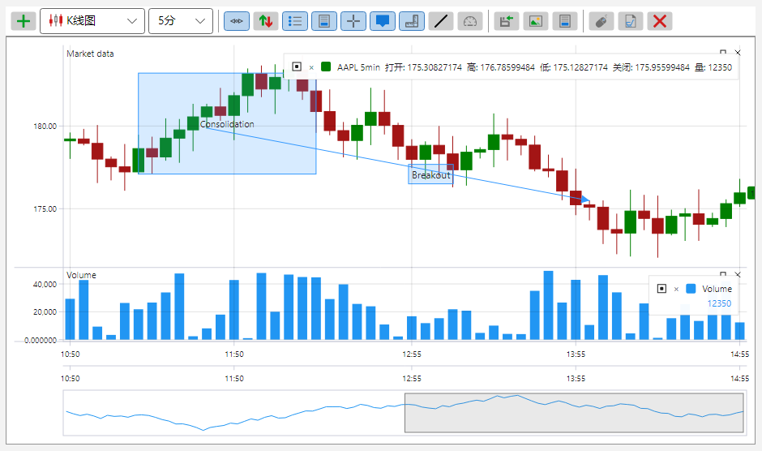
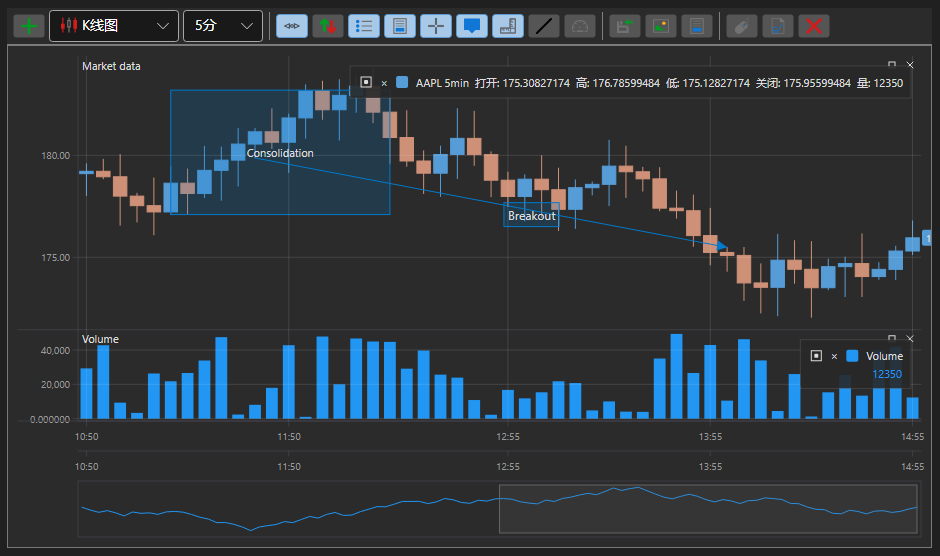

# S# 图形组件的主题

所有 S# 图形组件都有两种配色主题 \- 亮色和暗色。主题只在应用程序层面设置一次，所有组件会立即采用它：颜色取自资源，而不是在每个控件里单独写死。

亮色主题：



暗色主题：



设置主题只需要一行代码：

```cs
...
ThemeExtensions.ApplyDefaultTheme();
...
```

**[ThemeExtensions](xref:StockSharp.Xaml.ThemeExtensions) 的主要方法**

- [ThemeExtensions.ApplyDefaultTheme](xref:StockSharp.Xaml.ThemeExtensions.ApplyDefaultTheme(System.Boolean)) \- 应用暗色或亮色主题。
- [ThemeExtensions.Invert](xref:StockSharp.Xaml.ThemeExtensions.Invert) \- 切换到相反的主题。
- [ThemeExtensions.IsCurrDark](xref:StockSharp.Xaml.ThemeExtensions.IsCurrDark) \- 当前主题是否为暗色。

主题的切换立即生效：不需要重启应用程序，所有已打开的面板和图表都会以新的颜色重绘。

交易组件特有的颜色 \- 上涨和下跌、买入和卖出、订单簿档位、表格网格 \- 存放在单独的一组资源中，并随主题一起变化。因此，凡是从这组资源取色而不是自己写死颜色的自定义控件，在两种主题下看起来都同样得体。
