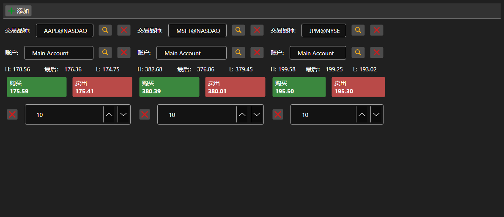

# 买卖面板集合



[BuySellGrid](xref:StockSharp.Xaml.BuySellGrid) - 由多个 [BuySellPanel](xref:StockSharp.Xaml.BuySellPanel) 组成的容器，每个标的一个面板，可在一个界面上交易多个标的。

**主要属性**

- [BuySellGrid.SecurityProvider](xref:StockSharp.Xaml.BuySellGrid.SecurityProvider) - 面板中用于选择的标的提供者。
- [BuySellGrid.Portfolios](xref:StockSharp.Xaml.BuySellGrid.Portfolios) - 投资组合来源。
- [BuySellGrid.MarketDataProvider](xref:StockSharp.Xaml.BuySellGrid.MarketDataProvider) - 面板获取最优报价的行情提供者。
- [BuySellGrid.Panels](xref:StockSharp.Xaml.BuySellGrid.Panels) - 当前的面板集合。

面板通过 [BuySellGrid.AddPanel](xref:StockSharp.Xaml.BuySellGrid.AddPanel(StockSharp.BusinessEntities.Security)) 添加，通过 [BuySellGrid.RemovePanel](xref:StockSharp.Xaml.BuySellGrid.RemovePanel(StockSharp.Xaml.BuySellPanel)) 移除。容器不注册订单，而是触发带有标的、投资组合、方向、价格和数量的 `OrderRegistering` 事件。面板组成通过 `Save` 和 `Load` 保存与恢复。

下面是其使用的代码片段:

```xaml
<Window x:Class="Sample.BuySellWindow"
	xmlns="http://schemas.microsoft.com/winfx/2006/xaml/presentation"
	xmlns:x="http://schemas.microsoft.com/winfx/2006/xaml"
	xmlns:xaml="http://schemas.stocksharp.com/xaml"
	Height="400" Width="900">
	<xaml:BuySellGrid x:Name="BuySellGrid" />
</Window>
```

```cs
// 为所有面板设置数据源
BuySellGrid.SecurityProvider = _connector;
BuySellGrid.MarketDataProvider = _connector;
BuySellGrid.Portfolios = new PortfolioDataSource(_connector);

// 按标的添加面板
BuySellGrid.AddPanel(_security);

// 注册面板生成的订单
BuySellGrid.OrderRegistering += (security, portfolio, side, price, volume) =>
{
	_connector.RegisterOrder(new Order
	{
		Security = security,
		Portfolio = portfolio,
		Side = side,
		Price = price,
		Volume = volume,
	});
};
```

## 另请参阅

[交易](../trading.md)
