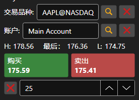

# 买/卖面板

[BuySellPanel](xref:StockSharp.Xaml.BuySellPanel) - 一个特殊面板，使您能够快速以最佳价格注册订单。



以下是添加 [BuySellPanel](xref:StockSharp.Xaml.BuySellPanel) 的代码示例。

```xaml
<Window x:Class="MainWindow"
		xmlns="http://schemas.microsoft.com/winfx/2006/xaml/presentation"
		xmlns:x="http://schemas.microsoft.com/winfx/2006/xaml"
		xmlns:d="http://schemas.microsoft.com/expression/blend/2008"
		xmlns:mc="http://schemas.openxmlformats.org/markup-compatibility/2006"
		xmlns:xaml="http://schemas.stocksharp.com/xaml"
		mc:Ignorable="d"
		Title="MainWindow" Height="662" Width="787" Left="10" Top="10">
	<Grid>
		<Grid.ColumnDefinitions>
			<ColumnDefinition Width="180"/>
			<ColumnDefinition Width="180"/>
			<ColumnDefinition Width="923*"/>
		</Grid.ColumnDefinitions>
		<Grid.RowDefinitions>
			<RowDefinition Height="30"/>
			<RowDefinition/>
		</Grid.RowDefinitions>
	    <xaml:BuySellPanel x:Name="BuySellPanel"  Grid.Row="1" Grid.ColumnSpan="3"/>
		<Button Grid.Row="0" Grid.Column="0" x:Name="Setting" Content="设置" Click="Setting_Click" />
		<Button Grid.Row="0" Grid.Column="1" x:Name="Connect" Content="连接" Click="Connect_Click" />
	</Grid>
</Window>
	  				
```

要用数据填充面板，您必须指定市场数据来源和工具来源。

```cs
		private void Connect_Click(object sender, RoutedEventArgs e)
		{
		    ...
			BuySellPanel.SecurityProvider = _connector;
			BuySellPanel.MarketDataProvider = _connector;
			...
		}
	  				
```
