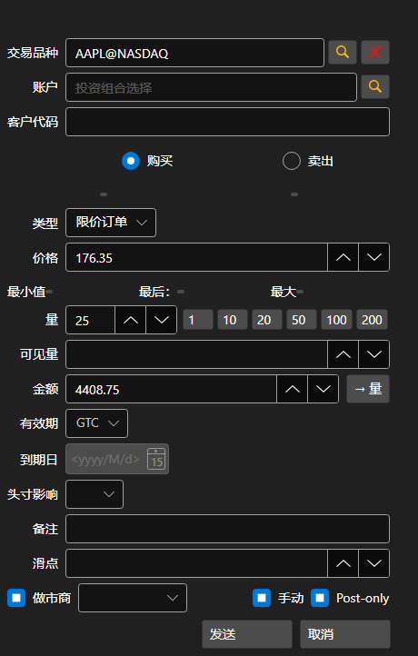

# 新建订单

[OrderWindow](xref:StockSharp.Xaml.OrderWindow) - 创建订单的窗口。



如果连接支持注册条件单（止损、止盈），那么在此窗口中可以通过设置 **高级条件** 标志来注册具有高级条件的条件单。

**基本属性**

- [OrderWindow.Portfolios](xref:StockSharp.Xaml.OrderWindow.Portfolios) - 投资组合列表。
- [OrderWindow.MarketDataProvider](xref:StockSharp.Xaml.OrderWindow.MarketDataProvider) - 市场数据提供商。
- [OrderWindow.SecurityProvider](xref:StockSharp.Xaml.OrderWindow.SecurityProvider) - 交易品种信息提供者。
- [OrderWindow.Order](xref:StockSharp.Xaml.OrderWindow.Order) - 已创建订单。

使用它的代码片段如下所示。示例代码取自 *Samples/01_Basic/03_Orders*。

```cs
...
private readonly Connector _connector = new Connector();
...
private void NewOrderClick(object sender, RoutedEventArgs e)
{
	var wnd = new OrderWindow
	{
		Order = new Order { Security = SecurityPicker.SelectedSecurity },
		SecurityProvider = _connector,
		MarketDataProvider = _connector,
		Portfolios = new PortfolioDataSource(_connector),
	};
	if (wnd.ShowModal(this))
		_connector.RegisterOrder(wnd.Order);
}
						
	  				
```
