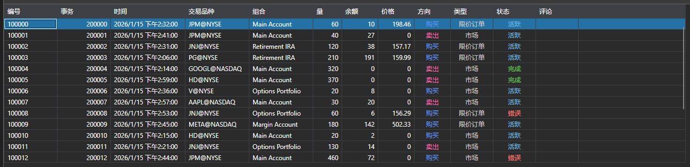

# 订单

[OrderGrid](xref:StockSharp.Xaml.OrderGrid) 是用于显示订单和条件订单的表格。此外，该表格的上下文菜单包含用于订单操作的命令：订单注册、替换和取消。选择菜单项会分别生成事件：[OrderGrid.OrderRegistering](xref:StockSharp.Xaml.OrderGrid.OrderRegistering)、[OrderGrid.OrderReRegistering](xref:StockSharp.Xaml.OrderGrid.OrderReRegistering) 或 [OrderGrid.OrderCanceling](xref:StockSharp.Xaml.OrderGrid.OrderCanceling)。



> [!TIP]
> 操作本身（注册、替换、取消）不会执行。相应的代码需要在事件处理程序中手动编写。

**主要成员**

- [OrderGrid.Orders](xref:StockSharp.Xaml.OrderGrid.Orders) - 订单列表。
- [OrderGrid.SelectedOrder](xref:StockSharp.Xaml.OrderGrid.SelectedOrder) - 已选择的订单。
- [OrderGrid.SelectedOrders](xref:StockSharp.Xaml.OrderGrid.SelectedOrders) - 已选择的订单。
- [OrderGrid.AddRegistrationFail](xref:StockSharp.Xaml.OrderGrid.AddRegistrationFail(StockSharp.BusinessEntities.OrderFail))**(**[StockSharp.BusinessEntities.OrderFail](xref:StockSharp.BusinessEntities.OrderFail) 失败 **)** - 将订单注册错误信息添加到备注字段的方法。
- [OrderGrid.OrderRegistering](xref:StockSharp.Xaml.OrderGrid.OrderRegistering) - 订单注册事件（在选择相应的上下文菜单项后发生）。
- [OrderGrid.OrderReRegistering](xref:StockSharp.Xaml.OrderGrid.OrderReRegistering) - 订购替换事件（在选择相应的上下文菜单项后发生）。
- [OrderGrid.OrderCanceling](xref:StockSharp.Xaml.OrderGrid.OrderCanceling) - 订单取消事件（在选择相应的上下文菜单项后发生）。

下面是显示其用法的代码片段。代码示例取自 *Samples/01_Basic/03_Orders*。

```xaml
<Window x:Class="Sample.OrdersWindow"
	xmlns="http://schemas.microsoft.com/winfx/2006/xaml/presentation"
	xmlns:x="http://schemas.microsoft.com/winfx/2006/xaml"
	xmlns:loc="clr-namespace:StockSharp.Localization;assembly=StockSharp.Localization"
	xmlns:xaml="http://schemas.stocksharp.com/xaml"
	Title="{x:Static loc:LocalizedStrings.Orders}" Height="410" Width="930">
	<xaml:OrderGrid x:Name="OrderGrid" x:FieldModifier="public" 
					OrderCanceling="OrderGrid_OnOrderCanceling" 
					OrderReRegistering="OrderGrid_OnOrderReRegistering" />
</Window>
	  				
```
```cs
private readonly Connector _connector = new Connector();

private void ConnectClick(object sender, RoutedEventArgs e)
{
	// 连接期间的其他代码...
	
	// 订阅订单接收事件
	_connector.OrderReceived += (subscription, order) => 
	{
		// 将订单添加到 OrderGrid 表
		_ordersWindow.OrderGrid.Orders.TryAdd(order);
	};
	
	// 用于连接连接器
	_connector.Connect();
}
					
// 撤销所有选定订单
private void OrderGrid_OnOrderCanceling(IEnumerable<Order> orders)
{
	// 遍历选定订单并逐个撤销
	foreach (var order in orders)
	{
		_connector.CancelOrder(order);
	}
}

// 打开订单编辑窗口并替换选定订单
private void OrderGrid_OnOrderReRegistering(Order order)
{
	var window = new OrderWindow
	{
		Title = LocalizedStrings.Str2976Params.Put(order.TransactionId),
		SecurityProvider = _connector,
		MarketDataProvider = _connector,
		Portfolios = new PortfolioDataSource(_connector),
		Order = order.ReRegisterClone(newVolume: order.Balance)
	};
	
	if (window.ShowModal(this))
		_connector.ReRegisterOrder(order, window.Order);
}
	  				
```

## 通过订阅处理订单

处理订单的现代方法涉及使用订阅：

```cs
// 订阅订单接收事件
_connector.OrderReceived += OnOrderReceived;

// 订单接收处理器
private void OnOrderReceived(Subscription subscription, Order order)
{
	// 检查订单是否属于目标订阅
	if (subscription == _ordersSubscription)
	{
		// 将订单添加到表
		_ordersWindow.OrderGrid.Orders.TryAdd(order);
		
		// 订单的附加处理
		Console.WriteLine($"已收到订单: {order.TransactionId}, 状态: {order.State}");
		
		// 如果订单处于最终状态，则更新 UI
		if (order.State == OrderStates.Done || order.State == OrderStates.Failed)
		{
			this.GuiAsync(() => {
				// 为已完成订单更新界面
			});
		}
	}
}
```

## 取消订单

```cs
// 订单撤销的现代方式
private void CancelOrder(Order order)
{
	try
	{
		_connector.CancelOrder(order);
		
		// 记录操作
		_logManager.AddInfoLog($"已发送订单撤销命令 {order.TransactionId}");
	}
	catch (Exception ex)
	{
		_logManager.AddErrorLog($"撤销订单时出错: {ex.Message}");
	}
}

// 批量撤销订单
private void CancelAllOrders()
{
	var activeOrders = _ordersWindow.OrderGrid.Orders
		.Where(o => o.State == OrderStates.Active)
		.ToArray();
		
	foreach (var order in activeOrders)
	{
		CancelOrder(order);
	}
}
```

## 处理订单注册和取消错误

```cs
// 订阅订单注册失败事件
_connector.OrderRegisterFailReceived += OnOrderRegisterFailed;

// 订单注册失败处理器
private void OnOrderRegisterFailed(Subscription subscription, OrderFail fail)
{
	// 将错误信息添加到 OrderGrid
	_ordersWindow.OrderGrid.AddRegistrationFail(fail);
	
	// 记录错误
	_logManager.AddErrorLog($"订单注册错误: {fail.Error}");
	
	// 通知用户
	this.GuiAsync(() => 
	{
		MessageBox.Show(this, 
			$"Failed to register order: {fail.Error}", 
			"Registration Error", 
			MessageBoxButton.OK, 
			MessageBoxImage.Error);
	});
}
```
