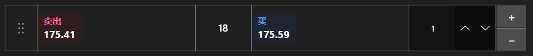

# 快速交易面板



[QuickOrderPanel](xref:StockSharp.Xaml.QuickOrderPanel) - 用于一键下单的紧凑面板。显示最优买价、最优卖价、价差和下单数量；点击任一方向即可立即生成订单。

**主要属性**

- [QuickOrderPanel.Security](xref:StockSharp.Xaml.QuickOrderPanel.Security) - 下单所用的标的。
- [QuickOrderPanel.Volume](xref:StockSharp.Xaml.QuickOrderPanel.Volume) - 下单数量。
- [QuickOrderPanel.BuyBackground](xref:StockSharp.Xaml.QuickOrderPanel.BuyBackground) - 买方向的背景。
- [QuickOrderPanel.SellBackground](xref:StockSharp.Xaml.QuickOrderPanel.SellBackground) - 卖方向的背景。

面板本身不会注册订单，它只生成 [Order](xref:StockSharp.BusinessEntities.Order) 对象并传给 `RegisterOrder` 事件。投资组合和额外校验在处理程序中完成。数量或外观变化会触发 `SettingsChanged`，适合在此保存设置。

下面是其使用的代码片段:

```xaml
<Window x:Class="Sample.QuickOrderWindow"
	xmlns="http://schemas.microsoft.com/winfx/2006/xaml/presentation"
	xmlns:x="http://schemas.microsoft.com/winfx/2006/xaml"
	xmlns:xaml="http://schemas.stocksharp.com/xaml"
	Height="300" Width="260">
	<xaml:QuickOrderPanel x:Name="QuickOrderPanel" Volume="10" />
</Window>
```

```cs
// 设置标的，面板会订阅其最优报价
QuickOrderPanel.Security = _security;

// 面板生成订单，由我们自己注册
QuickOrderPanel.RegisterOrder += order =>
{
	order.Portfolio = _portfolio;
	_connector.RegisterOrder(order);
};

// 设置变化时保存
QuickOrderPanel.SettingsChanged += () => SaveSettings();
```

## 另请参阅

[交易](../trading.md)
