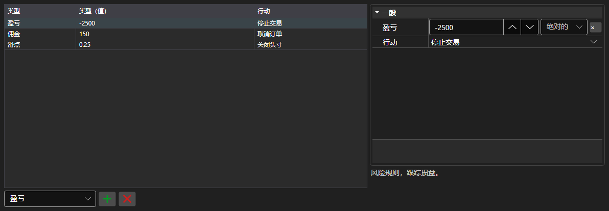

# 风险管理规则



[RiskPanel](xref:StockSharp.Xaml.RiskPanel) - 风险管理规则表格。可以添加、删除和配置 [IRiskRule](xref:StockSharp.Algo.Risk.IRiskRule) 规则，每条规则都有触发条件和触发动作。

**主要属性**

- [RiskPanel.Rules](xref:StockSharp.Xaml.RiskPanel.Rules) - 规则列表，与 [IRiskManager](xref:StockSharp.Algo.Risk.IRiskManager) 使用的列表相同。

左侧是规则列表：类型、条件取值和触发动作。右侧是所选规则的属性，每种类型各不相同。新规则通过表格下方的类型列表添加，多余的规则用旁边的按钮删除。列的组成与宽度通过 `Save` 和 `Load` 保存。

下面是其使用的代码片段:

```xaml
<Window x:Class="Sample.RiskWindow"
	xmlns="http://schemas.microsoft.com/winfx/2006/xaml/presentation"
	xmlns:x="http://schemas.microsoft.com/winfx/2006/xaml"
	xmlns:xaml="http://schemas.stocksharp.com/xaml"
	Height="400" Width="700">
	<xaml:RiskPanel x:Name="RiskPanel" />
</Window>
```

```cs
// 显示当前风险管理器的规则
RiskPanel.Rules.AddRange(_connector.RiskManager.Rules);

// 添加规则：亏损时停止交易
RiskPanel.Rules.Add(new RiskPnLRule
{
	PnL = -1000,
	Action = RiskActions.StopTrading,
});

// 把编辑后的规则写回风险管理器
_connector.RiskManager.Rules.Clear();
_connector.RiskManager.Rules.AddRange(RiskPanel.Rules);
```

## 另请参阅

[交易](../trading.md)
