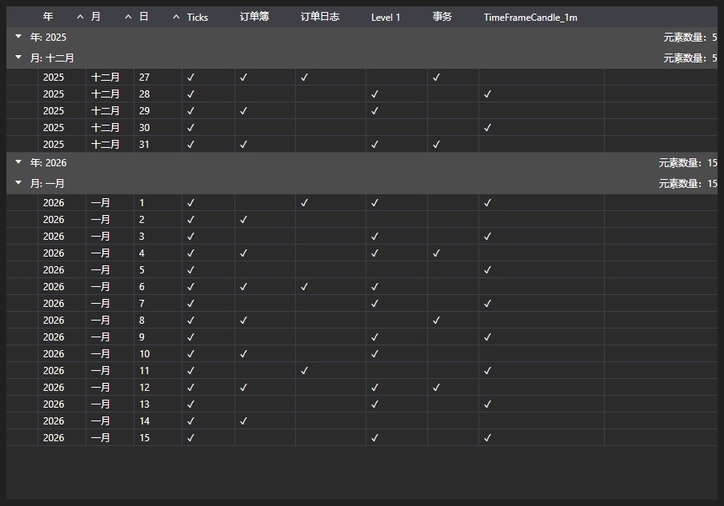

# 可用市场数据表

[MarketDataGrid](xref:StockSharp.Xaml.MarketDataGrid) - 一个显示可用市场数据的表格。



以下是将 [MarketDataGrid](xref:StockSharp.Xaml.MarketDataGrid) 表格添加到屏幕表单的代码示例。

```xaml
<Window x:Class="MainWindow"
		xmlns="http://schemas.microsoft.com/winfx/2006/xaml/presentation"
		xmlns:x="http://schemas.microsoft.com/winfx/2006/xaml"
		xmlns:d="http://schemas.microsoft.com/expression/blend/2008"
		xmlns:mc="http://schemas.openxmlformats.org/markup-compatibility/2006"
		xmlns:xaml="http://schemas.stocksharp.com/xaml"
		mc:Ignorable="d"
		Title="MainWindow" Height="662" Width="787" Left="10" Top="10">
	<Grid>
		<Grid.ColumnDefinitions>
			<ColumnDefinition Width="180"/>
			<ColumnDefinition Width="180"/>
			<ColumnDefinition Width="923*"/>
		</Grid.ColumnDefinitions>
		<Grid.RowDefinitions>
			<RowDefinition Height="30"/>
			<RowDefinition/>
		</Grid.RowDefinitions>
		<xaml:MarketDataGrid x:Name="MarketDataGrid"  Grid.Row="1" Grid.ColumnSpan="3" />
		<Button Grid.Row="0" Grid.Column="0" x:Name="Setting" Content="设置" Click="Setting_Click" />
		<Button Grid.Row="0" Grid.Column="1" x:Name="Connect" Content="连接" Click="Connect_Click" />
	</Grid>
</Window>
	  				
```
