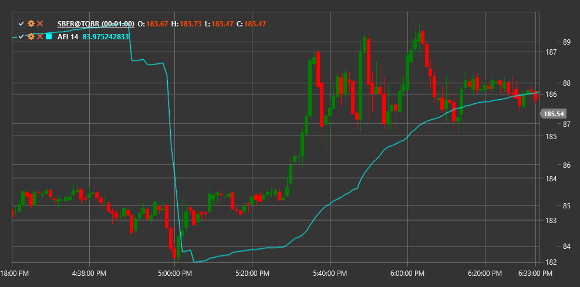

# 美国空军情报

**审批流指数 (AFI)** 是一个基于成交量与价格变动关系来衡量趋势强度的指标。

要使用该指标，您需要使用 [ApprovalFlowIndex](xref:StockSharp.Algo.Indicators.ApprovalFlowIndex) 类。

## 描述

审批流指数（AFI）有助于评估市场中订单流的强度，并确定当前趋势的强弱。该指标通过分析交易量与价格变动之间的关系来识别潜在的反转点或确认趋势的延续。

AFI 指标可用于：
- 确定当前趋势的强度
- 识别价格与指标之间的背离
- 寻找潜在的市场反转点

## 参数

该指标具有以下参数：
- **长度** - 指标的计算周期

## 计算

审批流指数的计算是基于分析特定期间的价格变化和成交量：

1. 首先，计算该期间的价格变动
2. 然后将这种变化与交易量联系起来
3. 将结果值在选定的周期（长度参数）上求和

AFI 旨在确定有多少交易量“认可”价格的变化。

正的 AFI 值表示强劲的上升趋势，而负值则表明下降趋势。接近零的值可能表示没有明显的趋势。

## 另请参阅

[ADL](accumulation_distribution_line.md)
[OBV](on_balance_volume.md)