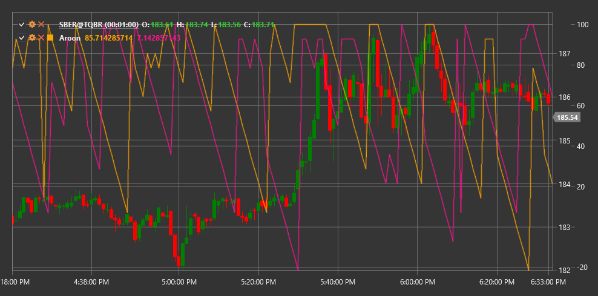

# 阿隆

**阿隆指标** 是由 Tushar Chande 于 1995 年开发的一种技术指标，用于识别趋势变化和趋势强度。名称 “Aroon” 来源于梵语，意思是“新纪元的黎明”。

要使用该指标，需要使用 [Aroon](xref:StockSharp.Algo.Indicators.Aroon) 类。

## 描述

Aroon 指标由两条线组成：
- **阿隆上升线** - 衡量上升趋势的强度
- **阿隆下** - 衡量下降趋势的强度

阿隆指标有助于确定：
- 新趋势的开始
- 当前趋势的强度
- 整合和横盘走势
- 潜在趋势反转

该指标对于识别新趋势形成的早期阶段以及确定盘整期特别有用。

## 参数

该指标具有以下参数：
- **长度** - 计算周期（通常使用14-25个周期）

## 计算

Aroon 指标的计算基于确定自达到指定周期内的最高价和最低价以来经过的时间（期间数）:

1. Aroon 上升指标的计算公式如下：
   ```
   Aroon 上升线 = ((Length - Periods since high) / Length) * 100
   ```

2. Aroon下跌是使用以下公式计算的：
   ```
   Aroon 下降线 = ((Length - Periods since low) / Length) * 100
   ```

其中：
- 长度 - 选定周期
- “自高点以来的周期”——自在指定周期内达到最高价格以来的周期数
- “自最低点以来的周期”——自在指定周期内达到最低价格以来的周期数

两条Aroon线在0到100之间振荡：
- 值为100表示最高/最低在最近一期达成
- 值为0意味着高点/低点是在Length周期前达到的

## 解释

- **强烈上升趋势**：Aroon 上升接近 100，Aroon 下降接近 0
- **强烈下行趋势**：Aroon下指标接近100，Aroon上指标接近0
- **横向移动**：两条线在低位平行移动
- **潜在的趋势反转**：Aroon上升线与Aroon下降线的交叉
- **整合**：两条线都围绕50波动



## 另请参阅

[ADX](adx.md)
[DMI](dmi.md)