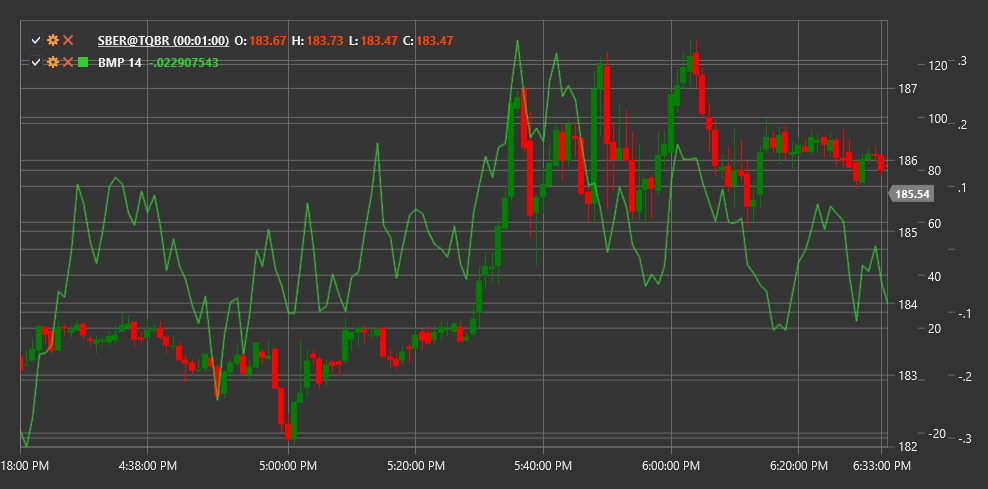

# BMP

**市场力量平衡（BMP）**是一个指标，用于衡量买家相对于卖家的力量，基于对价格变动和交易量的分析。

要使用该指标，您需要使用[BalanceOfMarketPower](xref:StockSharp.Algo.Indicators.BalanceOfMarketPower)类。

## 描述

市场力量平衡指标旨在评估市场中买卖双方当前力量的分布情况。它分析收盘价偏离其区间（高-低）的程度，并将其与交易量相关联。

BMP 帮助交易者：
- 确定主导市场方（买方或卖方）
- 识别潜在的趋势反转
- 检测价格与指标之间的背离
- 寻找超买和超卖水平

## 参数

该指标具有以下参数：
- **周期** - 平滑周期（默认值：14）

## 计算

BMP 计算分两个阶段进行：

1. 计算每根K线的BMP：
   ```
   Raw BMP = ((Close Price - Open Price) / (High - Low)) * Volume
   ```
如果（高 - 低）为零，则原始 BMP 设置为零。

2. 使用简单移动平均（SMA）平滑BMP：
   ```
   BMP = SMA(Raw BMP, Length)
   ```

其中：
- 收盘价 - 当前K线的收盘价格
- 开盘价 - 当前K线的开盘价格
- 当前K线的最高价
- 最低点 - 当前K线的最低价格
- 成交量 - 当前K线周期的交易量
- 长度 - 选择的平滑周期

## 解释

- **正的BMP值**表示市场中买方（多头）的主导地位
- **负BMP值** 表示市场中卖方（空方）的主导地位
- **穿越零线** 可以被视为趋势变化信号
- **极端值**（高于或低于某些水平）可能表明市场超买或超卖状态
- **BMP 与价格的偏离** 可能预示潜在的趋势反转



## 另请参阅

[平衡力量](balance_of_power.md)
[力量指数](force_index.md)
[累积/派发线](accumulation_distribution_line.md)
[能量潮](on_balance_volume.md)
