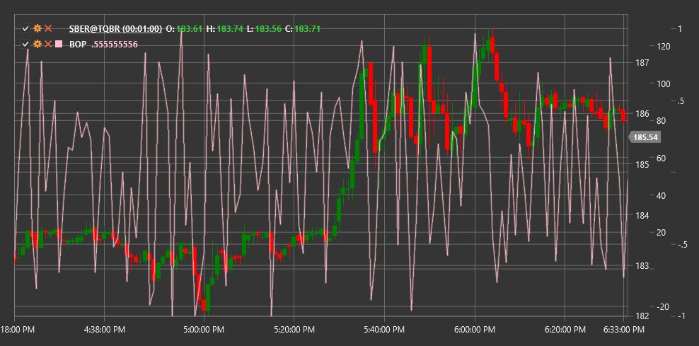

# BOP

**力量平衡（BOP）** 是一个指标，旨在通过评估多头（买方）将价格从低点推高到高点的能力来衡量多头相对于空头（卖方）的强弱。

使用该指标需要使用 [BalanceOfPower](xref:StockSharp.Algo.Indicators.BalanceOfPower) 类。

## 描述

力量平衡（BOP）指标显示市场中买方和卖方之间的力量平衡。它基于这样一种假设：在趋势中，买方（多头）或卖方（空头）可以在整个交易时段内控制价格。通过将收盘价与开盘价的差额与全价位范围（最高-最低）进行比较，该指标可以评估当前谁在主导市场。

BOP帮助交易者：
- 确定当前趋势的方向和强度
- 识别潜在的反转点
- 检测价格与指标之间的背离
- 确定超买和超卖水平

## 计算

计算权力平衡（BOP）指标的公式非常简单：

```
BOP = (Close - Open) / (High - Low)
```

地点：
- 收盘价
- 开盘价
- 期间最高价
- 低 - 该期间的最低价格

如果（高点 - 低点）为零，为避免除以零，BOP 被设置为零。

BOP 通常还会使用移动平均进行平滑，以减少波动性并提高信号可读性。

## 解释

- **正的BOP值**（高于零）表示买方（多头）在控制市场，这可能预示着上涨趋势。
- **负BOP值**（低于零）表明卖方（空头）正在控制市场，这可能预示着下降趋势。
- **穿越零线**可以被视为潜在趋势方向改变的信号。
- **极端值**（强烈正值或强烈负值）可能表明市场处于超买或超卖状态。
- **BOP 与价格之间的背离** 可能预示趋势反转：
  - 如果价格在上涨而BOP在下降，这可能是上升趋势减弱的警告。
  - 如果价格下跌而BOP上升，这可能表明下跌趋势可能即将结束。



## 另请参阅

[市场力量平衡](balance_of_market_power.md)
[力量指数](force_index.md)
[累积/派发线](accumulation_distribution_line.md)
[能量潮](on_balance_volume.md)