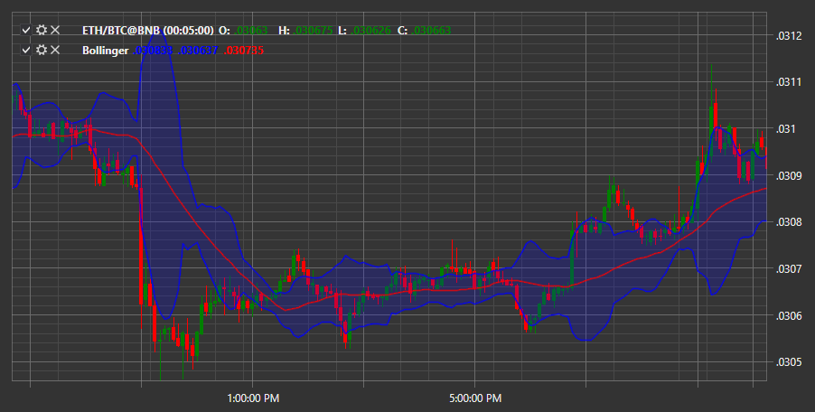

# 布林带

**布林带**是一种用来衡量市场波动性的振荡指标。它可以用来评估价格相对于移动平均线是高还是低。中间线对应价格的简单移动平均线。上轨和下轨是价格相对于移动平均线可被认为是高或低的水平。

要使用该指标，应使用 [BollingerBands](xref:StockSharp.Algo.Indicators.BollingerBands) 类。
##### 计算

计算布林带使用以下参数及相应设置：
- 标准偏差类型——通常为双倍；
- 移动平均周期 — 由交易者自行决定。

因此，该指标由三条线组成：中线、上线和下线，每条线都有其公式：

中线 (ML) = 移动平均线 (简单移动平均线 (收盘价, N))
上轨 = ML + (D × 标准差)
下轨 = ML - (D × 标准差)，其中

D - 在设置中设置的通道宽度，标准差 (StdDev) - 标准差，按照公式计算：SQRT(Sum(Close, n))^2, n)/n)，其中
Sum - n 期间的总和, n - 计算期数, SQRT - 平方根, Close - 收盘价。

## 另请参阅

[CHV](chv.md)
