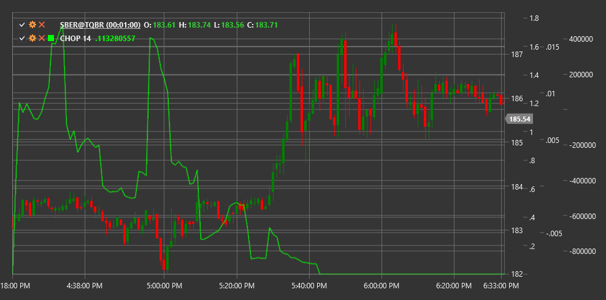

# CHOP

**震荡指数 (CHOP)** 是一个旨在判断市场是处于横向波动（区间内）还是趋势状态的指标。

使用该指标时，需要使用 [ChoppinessIndex](xref:StockSharp.Algo.Indicators.ChoppinessIndex) 类。

## 描述

波动混乱指数（CHOP）是用于定量评估波动性并确定市场走势性质的指标。与许多其他指标不同，CHOP 并不是用来识别趋势方向或生成买卖信号的。相反，它帮助交易者判断市场是处于盘整（横向移动）还是处于方向性趋势中。

CHOP 指标在 0 到 100 之间振荡：
- 接近 100 的数值表示强烈整合（高“波动性”）
- 接近 0 的数值表示强烈的方向性趋势（低“波动性”）

CHOP 对以下情况特别有用：
- 根据市场特征确定合适的交易策略
- 识别从横盘行情到趋势行情的转换及其逆向转换
- 确认或否定来自其他指标的信号
- 在整理期间避免假信号

## 参数

该指标具有以下参数：
- **周期** - 计算周期（默认值：14）

## 计算

波动指数计算包括以下步骤：

1. 计算所选期间的真实波动幅度总和：
   ```
   TR之和 = i 从 1 到 Length 的 Sum(TR(i))
   ```

2. 计算所选期间的最高高点和最低低点：
   ```
   最高高点 = Length 周期内 High 的最大值
   最低低点 = Length 周期内 Low 的最小值
   ```

3. 计算CHOP指数：
   ```
   CHOP = 100 * LOG10(Sum TR / (最高高点 - 最低低点)) / LOG10(Length)
   ```

其中：
- TR - 每根K线的真实范围
- 长度 - 选定周期
- LOG10 - 十进制对数

## 解释

- **高 CHOP 值（超过 60-70）** 表明市场处于横盘走势（整合期）。在此期间，最好避免趋势策略，考虑区间交易策略。

- **低 CHOP 值（低于 30-40）** 表示强烈的趋势方向。这是使用趋势策略并跟随价格走势的好时机。

- **高低值之间的过渡** 可以表明市场特性的变化。 从高值下降的 CHOP 可能预示着新趋势的开始。 从低值上升的 CHOP 可能警示趋势疲软并转向盘整。

- **设置阈值水平**：通常使用以下阈值水平：
  - 60-70以上：高“波动性”（横向运动）
  - 30-60：中度“波动”（过渡状态）
  - 低于30：低“波动性”（强烈趋势）



## 另请参阅

[平均真实波幅](atr.md)
[ADX](adx.md)
[VHF](vhf.md)
[真实波动幅度](true_range.md)
