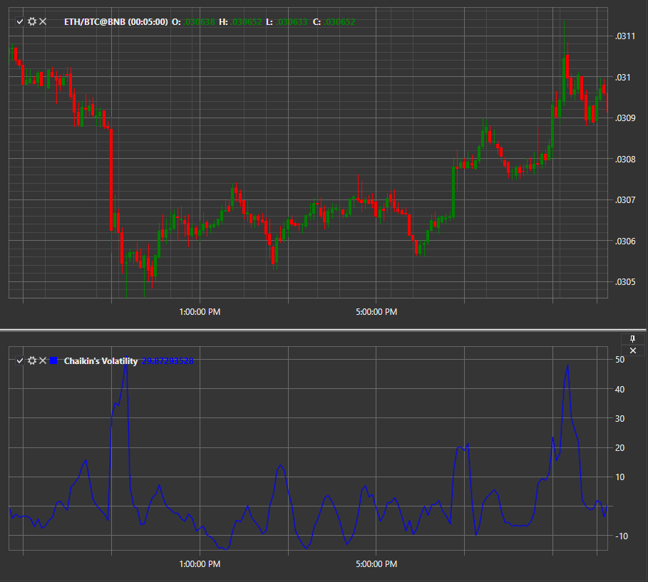

# CHV

**Chaikin 波动率 (CHV)** 表示一段时间内买入最大值与卖出最小值之间的差异。该指标允许对价格变化及价格最高值与最低值之间的幅度进行定性分析。CHV 在计算中不考虑价格缺口，这在某种程度上可以被认为是一个缺点。

使用该指标时，应使用 [ChaikinVolatility](xref:StockSharp.Algo.Indicators.ChaikinVolatility) 类。
##### 计算

Chaikin 波动指标的计算首先确定价差——当前K线的最高价与最低价之差。得到的结果通过对应周期的指数移动平均进行平滑处理。波动性通过公式计算：

CHV = (EMA(H-L(i), n) — EMA(H-L(i-n), n)) / EMA(H-L(i-n), n) x 100。

在这里，H-L(i)表示当前K线的价格差，H-L(i-n)表示n周期之前K线的价格差。因此，我们能够直观地看到价格随时间的变化情况。

指标的主要参数：

- **ROCPeriod** — 相对于其进行计算的周期数。最初设置为5。
- **SmoothPeriod** — 移动平均的周期。默认设置为 32。

## 另请参阅

[首席营销官](cmo.md)