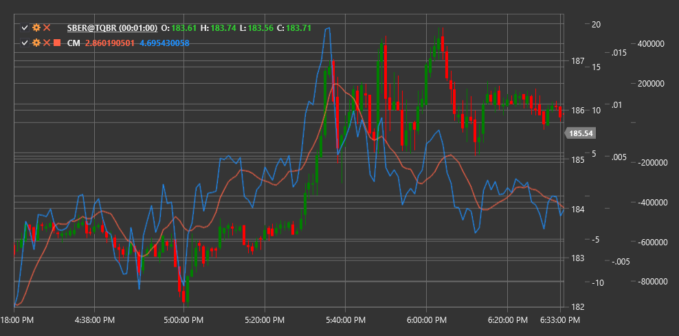

# 厘米

**复合动量（CM）** 是一种结合多种价格动量测量方法的指标，以获得关于趋势强度和方向的更可靠信号。

要使用该指标，您需要使用 [CompositeMomentum](xref:StockSharp.Algo.Indicators.CompositeMomentum) 类。

## 描述

复合动量（CM）指标是一种综合工具，整合了价格变动的各个方面，包括价格变化率、相对强弱及其他动量组成部分。通过这种综合方法，CM 比传统的单维度动量指标提供了更完整的当前市场动量图景。

CM 对以下方面有效：
- 确定当前趋势的强度
- 识别潜在的反转点
- 检测价格与动量之间的背离
- 过滤其他指标的假信号

复合动量在传统动量指标可能产生大量虚假信号的波动市场中特别有用。

## 计算

复合动量计算涉及几个阶段和组成部分：

1. 计算动量分量：
   - 与前期相比的价格变化
   - 近期高点和低点之间的比率
   - 伴随价格变动的成交量分析

2. 将每个组件归一化，以使它们达到可比较的尺度。

3. 对各组件进行加权求和以获得最终的 CM 值。

最终的 CM 值是一个振荡器，可以在正负区域波动：
- 正值表示上升动能
- 负值表示向下的动量
- 数值的大小（绝对值）表示动量的强度

## 解释

- **零线穿越**:
  - 从负区转向正区可以被视为看涨信号
  - 从正区过渡到负区可以被视为看跌信号

- **极端值**：
  - 非常高的正值可能表示市场超买状态
  - 非常低的负值可能表明市场超卖状况

- **分歧**：
  - 看涨背离：价格创出新低，而CM形成更高的低点
  - 看跌背离：价格创出新高，而CM形成更低的高点

- **趋势确认**:
  - 持续为正的CM值确认了上升趋势的强度
  - 持续为负的CM值确认了下行趋势的强度

- **动量损失**：
  - 沿趋势方向的CM绝对值下降可能预示动能减弱和潜在的反转

## 另请参阅

[动量](momentum.md)
[ROC](roc.md)
[相对强弱指数](rsi.md)
[MACD](macd.md)