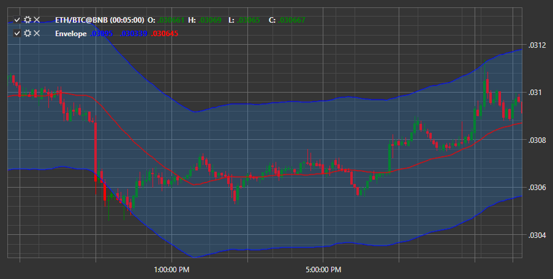

# 包络线

**包络线** 是一种通过将移动平均线偏移特定数值形成通道的指标。构建该指标的方法与布林带的构建完全相同，只是在外线距离平均线的距离计算上有所不同。如果布林带使用标准差进行计算，在 **包络线** 中，这个距离是在设置中手动设置的。
设置的参数包括移动平均线的周期和偏离幅度。

要使用该指标，应使用 [Envelope](xref:StockSharp.Algo.Indicators.Envelope) 类。

## 另请参阅

[EMA](ema.md)
