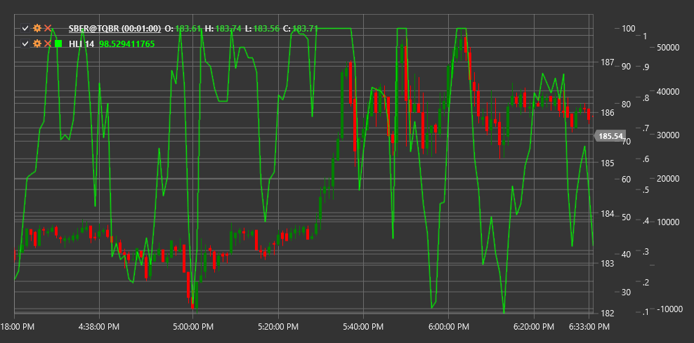

# HLI

**高低指数 (HLI)** 是一个技术指标，用于衡量在特定时间段内达到新高的股票数量与达到新低的股票数量的比率。

要使用该指标，您需要使用 [HighLowIndex](xref:StockSharp.Algo.Indicators.HighLowIndex) 类。

## 描述

高低指标（HLI）是一种市场广度指标，通过比较达到新高的交易品种数量与达到新低的交易品种数量来分析整体市场活动。这可以用来评估市场的内部强弱。

该指标的主要理念是，健康的市场特征是达到新高的交易品种数量多于达到新低的交易品种数量。相反，疲弱的市场则会有更多交易品种达到新低。

HLI 在以下方面特别有用：
- 评估整体市场状况
- 识别指数与单个市场交易品种之间的分歧
- 确定潜在的市场反转点
- 确认其他指标的信号

## 参数

该指标具有以下参数：
- **周期** - 计算周期（默认值：14）

## 计算

高低指数计算涉及以下步骤：

1. 统计在指定期间内达到新高的交易品种数量：
   ```
   新高数量 = Length 周期内创出新高的交易品种数量
   ```

2. 统计在指定期间内达到新低的交易品种数量：
   ```
   新低数量 = Length 周期内创出新低的交易品种数量
   ```

3. 将新高与新低之差与它们的总和之比计算为高低指数：
   ```
   HLI = ((新高数量 - 新低数量) / (新高数量 + 新低数量)) * 100
   ```

注意：如果（新高 + 新低）等于零，为避免除以零，HLI 设置为零。

## 解释

高低指数的解释如下：

1. **数值范围**：
   - HLI 在 -100 和 +100 之间波动
   - 正值表示达到新高的交易品种多于达到新低的交易品种
   - 负值表示达到新低的交易品种多于达到新高的交易品种

2. **零线交叉**：
   - 从负值转向正值可以被视为看涨信号
   - 从正值转向负值可以被视为看跌信号

3. **极端值**：
   - 接近 +100 的数值表示强烈的多头市场（可能存在超买情况）
   - 接近 -100 的数值表示市场强烈看跌（可能出现超卖情况）

4. **分歧**：
   - 看涨背离：市场指数创出新低，但HLI形成更高的低点
   - 看跌背离：市场指数创出新高，但HLI形成较低高点

5. **HLI 趋势**:
   - 持续的HLI增长表明牛市正在增强
   - 持续的HLI下降表明熊市正在增强

6. **市场趋势确认**：
   - 如果市场指数上涨，而HLI也上涨，这确认了上涨趋势的强劲
   - 如果市场指数下跌，HLI也下跌，这确认了下跌趋势的强度



## 另请参阅

[麦克莱兰振荡器](mcclellan_oscillator.md)
