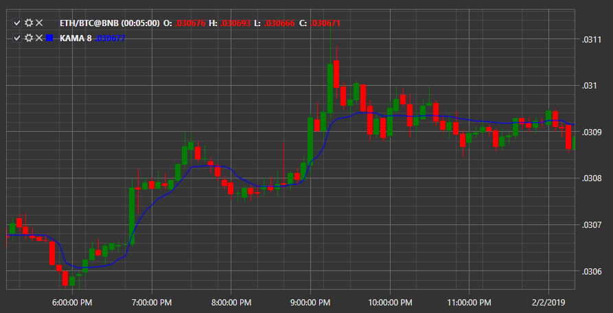

# 卡马

**考夫曼自适应移动平均线 (AMA, KAMA, AMkA)** 由佩里·考夫曼开发，用于考虑市场噪音和波动性。KAMA 指标可用于识别时间上的反转点、确定整体趋势以及过滤价格波动。

要使用该指标，应使用 [KaufmanAdaptiveMovingAverage](xref:StockSharp.Algo.Indicators.KaufmanAdaptiveMovingAverage) 类。

##### 指标设置

- 快速移动平均 - 快速平滑常数；
- 慢速移动平均线 - 慢速平滑常数；
- 周期 - 考夫曼移动平均的周期。

