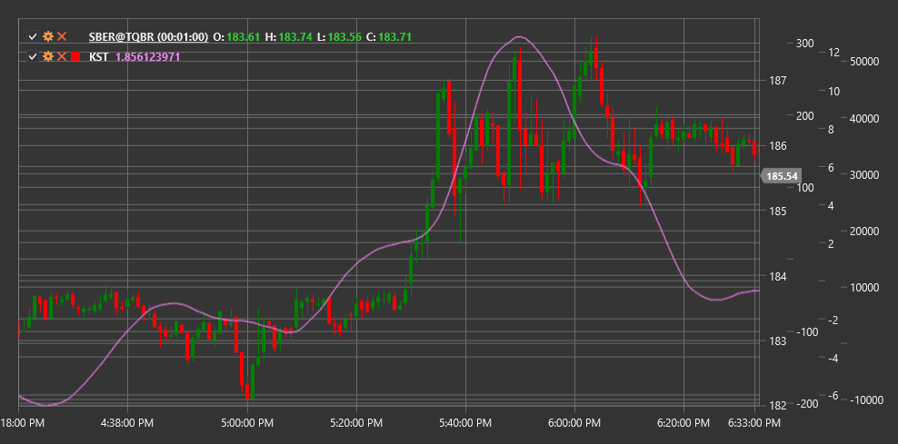

# KST

**确定事物指标（KST）** 是由马丁·普林（Martin Pring）开发的一个技术指标，它表示四个不同周期的平滑变动率（ROC）的总和，用于识别长期市场周期。

使用该指标时，您需要使用 [KnowSureThing](xref:StockSharp.Algo.Indicators.KnowSureThing) 类。

## 描述

确定无疑指标（KST）是由马丁·普林（Martin Pring）开发的一种振荡器，用于通过测量不同时间段的价格动量来识别趋势。该指标结合了四个不同周期的变化率（ROC）测量，并赋予较长周期更高的重要性。

KST 基于这样一种理论：不同持续时间的市场周期共同影响价格走势。通过结合不同时期的 ROC，KST 旨在识别长期周期趋势并确定潜在的反转点。

该指标通常伴随着一条信号线（KST的移动平均线），它们的交叉可用于生成交易信号。

## 计算

KST 指标的计算涉及以下步骤：

1. 计算四个不同周期的变化率（ROC）测量值：
   ```
   ROC1 = ((Close / Close[n1 periods ago]) - 1) * 100
   ROC2 = ((Close / Close[n2 periods ago]) - 1) * 100
   ROC3 = ((Close / Close[n3 periods ago]) - 1) * 100
   ROC4 = ((Close / Close[n4 periods ago]) - 1) * 100
   ```

2. 使用简单移动平均线 (SMA) 平滑每个 ROC：
   ```
   RCMA1 = SMA(ROC1, m1)
   RCMA2 = SMA(ROC2, m2)
   RCMA3 = SMA(ROC3, m3)
   RCMA4 = SMA(ROC4, m4)
   ```

3. 加权求和以获得KST：
   ```
   KST = (RCMA1 * 1) + (RCMA2 * 2) + (RCMA3 * 3) + (RCMA4 * 4)
   ```

4. 计算信号线：
   ```
   信号线 = SMA(KST, 信号周期)
   ```

其中：
- 收盘价
- n1, n2, n3, n4 - ROC计算的周期（默认值：10, 15, 20, 30）
- m1, m2, m3, m4 - ROC 平滑的周期（默认值：10, 10, 10, 15）
- 信号周期 - 信号线周期（默认值：9）

## 解释

KST指标可以解释如下：

1. **零线交叉**：
   - 当 KST 从下向上穿过零线时，可以被视为看涨信号
   - 当 KST 从上向下穿过零线时，可以被视为看跌信号

2. **信号线交叉**：
   - 当KST从下方上穿信号线时，可以视为看涨信号（比穿越零线更敏感）
   - 当KST从上方向下穿过信号线时，可以视为一个看跌信号（比零线穿越更敏感）

3. **分歧**：
   - 看涨背离：价格形成新低，而KST形成更高的低点
   - 看跌背离：价格形成新高，而KST形成较低的新高

4. **极端值**：
   - 高正KST值可能表明市场超买状态
   - 高负KST值可能表示市场超卖状态

5. **移动方向**：
   - KST上涨趋势表明整体的市场看涨情绪
   - KST下行趋势表明整体市场情绪偏空

6. **趋势确认**:
   - KST 可用于确认其他指标的信号
   - KST方向与价格的一致性确认了当前趋势的强度

7. **市场情绪分析**:
   - 正的 KST 值表示看涨情绪占主导
   - 负的 KST 值表示看跌情绪占主导



## 另请参阅

[ROC](roc.md)
[MACD](macd.md)
[动量](momentum.md)
[相对强弱指数](rsi.md)
