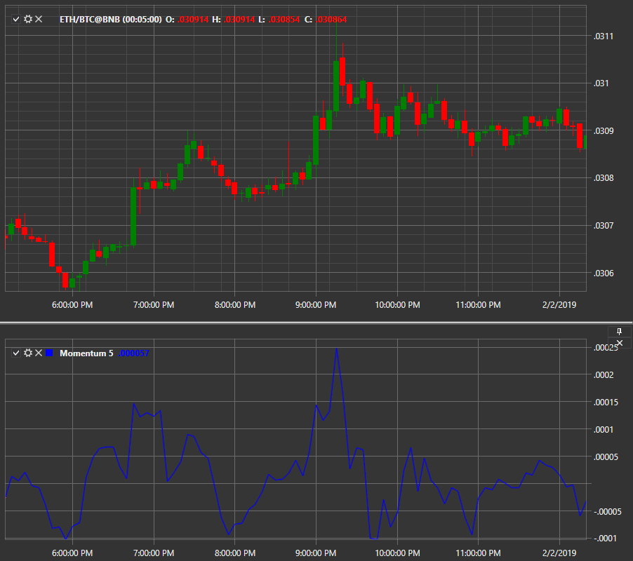

# 动量

**动量**指标衡量金融工具在一定期间内价格变化的幅度。当曲线达到最大或最小值时，它显示超买和超卖的时刻。向指标添加平滑移动平均线可以改善对趋势变化的解读。

要使用该指标，应使用[动量](xref:StockSharp.Algo.Indicators.Momentum)类。
##### 计算

动量定义为今日价格与 n 周期前价格的比率：

动量 = CLOSE(i) / CLOSE(i - n) * 100

其中：
CLOSE(i) — 当前K线的收盘价；
CLOSE(i - n) — n 根K线之前的收盘价。

## 另请参阅

[资金流向指数](money_flow_index.md)
