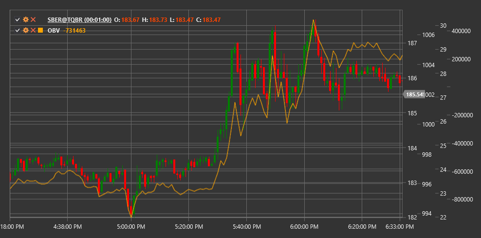

# OBV

**能量潮指标（OBV）** 是由约瑟夫·格兰维尔（Joseph Granville）开发的一种技术指标，它通过根据价格方向累积交易量来预测价格变化。

要使用该指标，您需要使用 [OnBalanceVolume](xref:StockSharp.Algo.Indicators.OnBalanceVolume) 类。

## 描述

累计能量线（OBV）是一种累积指标，当收盘价上涨时增加成交量，当收盘价下跌时减少成交量。该指标基于成交量变化先于价格变化的概念。根据这一理论，当成交量显著增加而价格没有相应变化时，应预期价格最终会上涨，反之亦然。

OBV旨在检测“聪明资金”（大型机构投资者）正在积累或分配头寸的时刻，这可能预示未来的价格走势。该指标特别适用于识别价格与成交量之间的背离，这可能预示潜在的市场反转。

OBV指标最早由约瑟夫·格兰维尔在1963年他的著作《格兰维尔的股票市场利润新钥匙》中提出，从那时起，它已经成为最广泛使用的成交量指标之一。

## 计算

平衡交易量（On-Balance Volume）的计算非常简单：

1. 设置初始OBV值（通常为0或任意数字）：
   ```
   OBV[initial] = 0
   ```

2. 对于每一个后续时期：
   ```
   If Close[current] > Close[previous], then:
       OBV[current] = OBV[previous] + Volume[current]
   If Close[current] < Close[previous], then:
       OBV[current] = OBV[previous] - Volume[current]
   If Close[current] = Close[previous], then:
       OBV[current] = OBV[previous]
   ```

地点：
- 收盘价
- 成交量 - 交易量

## 解释

累计成交量可以解释如下：

1. **趋势分析**:
   - OBV上升表示资金流入市场（积累），这可能预示价格上涨
   - OBV下降表示交易量正在离开市场（分配），这可能预示价格下跌
   - 平坦的OBV表示没有方向性的成交量变化，这可能对应横盘走势

2. **价格趋势确认**：
   - 如果OBV与价格走势方向相同，这将确认当前的价格趋势
   - 如果OBV和价格走势相反，这可能预示潜在的趋势反转

3. **分歧**：
   - 看涨背离：价格形成新低，而OBV形成更高的低点（买入信号）
   - 看跌背离：价格形成新高，而OBV形成较低高点（卖出信号）

4. **OBV 突破**：
   - OBV突破阻力位或支撑位通常会先于价格图表上的类似突破
   - 交易者可以使用OBV趋势线突破来预测未来的价格走势

5. **基线**：
   - 一些交易者使用OBV移动平均线作为“基线”
   - OBV突破其移动平均线可以产生交易信号

6. **技术分析形态**：
   - 经典的技术分析图形可以在OBV图表上形成，例如“头肩顶”、“双底”等。
   - 这些模式可以提供额外的交易信号

7. **成交量激增**：
   - OBV的突然急剧变化可能表明市场情绪发生重大变化
   - 这种“成交量激增”通常会出现在大幅价格变动之前

需要注意的是，OBV 是一个累积指标，因此其绝对值并不是很重要。OBV 运动的方向及其与价格运动的关系才是关键。



## 另请参阅

[累积/派发线](accumulation_distribution_line.md)
[查金资金流量](chaikin_money_flow.md)
[力量指标](force_index.md)
[负成交量指标](negative_volume_index.md)