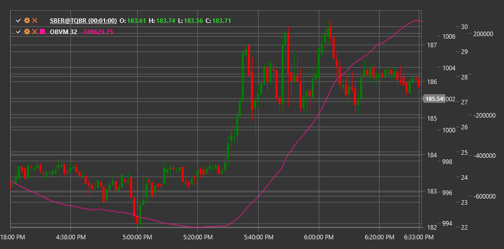

# OBVM

**累计能量均值（OBVM）** 是一个技术指标，表示累计能量（OBV）指标的移动平均值，可根据成交量提供更清晰的趋势信号。

使用该指标时，需要使用 [OnBalanceVolumeMean](xref:StockSharp.Algo.Indicators.OnBalanceVolumeMean) 类。

## 描述

平衡交易量均值（OBVM）是经典平衡交易量（OBV）指标的一个改进版，它对OBV值应用移动平均，以平滑波动并识别更清晰的趋势。该指标保持了OBV的核心概念——基于价格方向变化的成交量积累，但增加了一个额外的过滤层。

OBVM 有助于消除原始 OBV 中的噪音，并使长期的成交量流动趋势更加明显。这在波动性较大的市场或分析交易量不规律的工具时尤其有用。

OBVM 的主要优势在于相比经典 OBV，它能够生成更清晰且较少出现虚假信号的交易信号。该指标还可以用来识别 OBV 与其平均值之间的交叉，为交易提供额外的机会。

## 参数

该指标具有以下参数：
- **长度** - 移动平均计算周期（默认值：20）

## 计算

累计成交量均值的计算涉及以下步骤：

1. 计算基础的能量潮（OBV）指标：
   ```
   If Close[current] > Close[previous]:
       OBV[current] = OBV[previous] + Volume[current]
   If Close[current] < Close[previous]:
       OBV[current] = OBV[previous] - Volume[current]
   If Close[current] = Close[previous]:
       OBV[current] = OBV[previous]
   ```

2. 将移动平均应用于OBV值：
   ```
   OBVM = SMA(OBV, Length)
   ```

其中：
- 收盘价
- 成交量 - 交易量
- OBV - 累积/派发线
- SMA - 简单移动平均
- 长度 - 移动平均周期

注意：其他类型的移动平均线，如 EMA（指数移动平均线）、WMA（加权移动平均线）等，可以用来替代 SMA。

## 解释

累计成交量均值可以解释如下：

1. **趋势分析**:
   - OBVM上升表明有强劲成交量支持的看涨趋势
   - OBVM下降表明在强量支持下的看跌趋势
   - 平坦的OBVM表明没有明显的趋势

2. **OBV 和 OBVM 交叉**：
   - 当OBV从下向上穿过OBVM时，可以视为看涨信号
   - 当OBV从上向下穿过OBVM时，可以视为看跌信号
   - 这些交叉往往表示新趋势或重大价格变动的开始

3. **分歧**：
   - 看涨背离：价格形成新低，而OBVM形成更高的低点
   - 看跌背离：价格形成新高，而OBVM形成较低的高点
   - 背离通常出现在重要趋势反转之前

4. **价格趋势确认**：
   - 如果OBVM与价格方向一致，这就确认了当前的价格趋势
   - 如果OBVM和价格走势相反，这可能预示潜在的趋势反转

5. **支撑和阻力位**：
   - OBVM 图表可以形成它自己的支撑位和阻力位
   - 这些水平的突破可能会先于价格图表上的类似突破

6. **与其他成交量指标的比较**：
   - OBVM 可以与其他成交量指标进行比较以确认信号
   - 来自多个成交量指标的信号一致性提高了它们的可靠性

7. **长度参数选择**：
   - 较短的周期（e.g., 10-15）使OBVM对短期变化更敏感
   - 较长周期（e.g., 30-50）更好地识别长期趋势
   - 最佳期限取决于交易时间范围和特定工具的特性



## 另请参阅

[OBV](on_balance_volume.md)
[ADL](accumulation_distribution_line.md)
[蔡金资金流量指标](chaikin_money_flow.md)
[强弱指数](force_index.md)