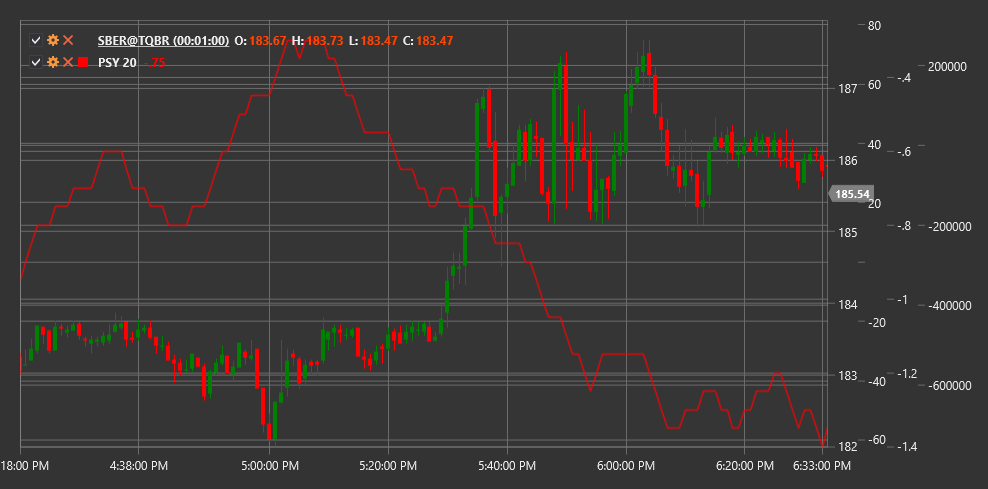

# PSY

**心理线 (PSY)** 是一个技术指标，用于衡量在指定时间间隔内上涨周期（K线、K线）占总周期数的比例。

要使用该指标，您需要使用 [PsychologicalLine](xref:StockSharp.Algo.Indicators.PsychologicalLine) 类。

## 描述

心理线（PSY）是一个简单但有效的指标，通过计算上涨周期占考虑周期总数的百分比来反映市场情绪。该指标基于市场心理和投资者情绪在价格波动中起关键作用的假设。

PSY 是一个振荡器，其数值范围为0到100，其中：
- 值为100意味着在所有考虑的时期内价格都上涨了
- 值为0表示在所有考虑的时期内价格都下跌
- 值为50意味着上涨期和下跌期的数量相等

PSY 指标有助于判断市场是否处于超买或超卖状态，并可以预测潜在的趋势反转。

## 参数

该指标具有以下参数：
- **长度** - 计算周期（默认值：12-14）

## 计算

心理线的计算非常简单：

```
PSY = (Length 周期内上涨周期数量 / Length) * 100
```

其中：
- 上涨周期被定义为收盘价高于前一周期收盘价的周期
- 长度 - 考虑的周期数

## 解释

心理线可以解释如下：

1. **超买和超卖水平**：
   - 高于70-80的数值表示市场超买状态（上涨周期过多）
   - 低于20-30的数值表示市场超卖状态（过多周期处于下跌）
   - 极端值通常先于趋势反转出现

2. **中心线 (50)**:
   - 从下向上突破50水平可以被视为看涨信号
   - 从上向下突破50水平可以被视为看跌信号
   - 持续在50以上的运动表明多头占优
   - 持续低于50的运动表明空头占主导地位

3. **分歧**：
   - 看涨背离：价格形成新低，而心理指数形成更高的低点
   - 看跌背离：价格形成新高，而心理指数形成较低高点

4. **从极端水平反弹**：
   - PSY 从超买区反转可能预示潜在的看跌反转
   - PSY 从超卖区反转可能预示潜在的看涨反转

5. **趋势分析**:
   - 在强烈的上升趋势中，PSY 通常保持在 50 以上，并会从超买区周期性反弹
   - 在强烈的下行趋势中，PSY通常保持在50以下，并且会从超卖区间周期性反弹

6. **长度参数调优**：
   - 较短的周期（例如， 5-8）使PSY更敏感，更适合短期交易
   - 更长周期（例如， 20-25）使PSY更平滑，适合长期交易

7. **与其他指标结合**：
   - PSY常与其他指标结合使用以确认信号
   - 在与趋势指标和成交量指标结合使用时尤其有用



## 另请参阅

[相对强弱指数](rsi.md)
[随机振荡器](stochastic_oscillator.md)
[终极振荡器](uo.md)
[动量振荡器](momentum.md)
