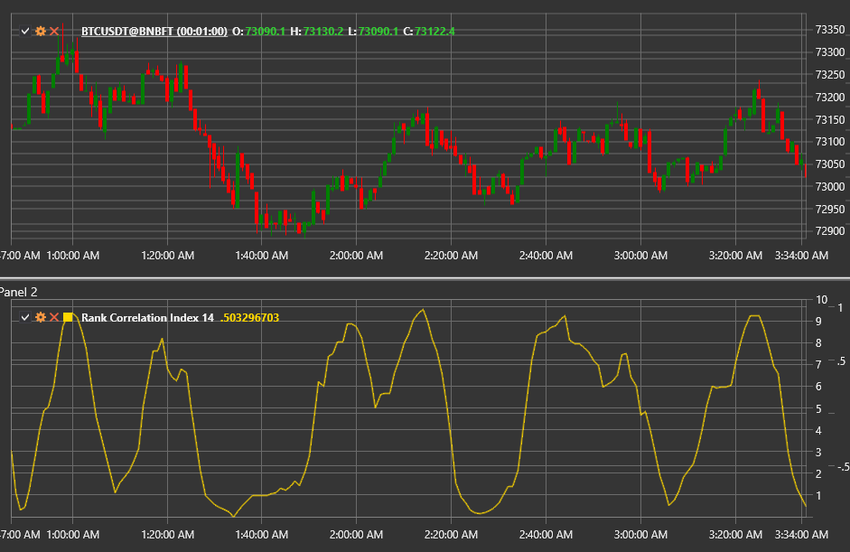

# 等级相关指数

**秩相关指数 (RCI)** 是一种基于斯皮尔曼秩相关系数的振荡器。它将价格秩
与移动窗口内的时间秩进行比较，并显示最近的走势与完全上升或下降序列的接近程度。

使用 [RankCorrelationIndex](xref:StockSharp.Algo.Indicators.RankCorrelationIndex) 类来访问该指标。

## 计算

1. 为 **Length** 窗口内的每个数据点分配一个时间排名（最旧的值为 1，`Length` 为最新的值）。
2. 按价值对价格进行排名（1表示最低价，`Length`表示最高价）。
3. 计算每个条形的差异 `d = RankTime − RankPrice`。
4. 应用斯皮尔曼公式：
`RCI = 1 − (6 × Σ d²) / (Length × (Length² − 1))`。

当乘以100时，指标范围在−100到+100之间。

## 参数

- **Length** — 排名过程的窗口大小。

## 解释

- **RCI ≈ +100** — 完美上升序列（强劲上涨趋势）。
- **RCI ≈ −100** — 完美下跌序列（强烈下跌趋势）。
- **RCI 接近 0** — 随机或横盘市场。
- 价格与RCI之间的偏离警示可能的反转。

该指标有助于短期趋势评估和发现转折点，尤其是与动量工具结合使用时。

## 另请参阅

[动量](momentum.md)
[ROC](roc.md)
[相对强弱指数](rsi.md)
