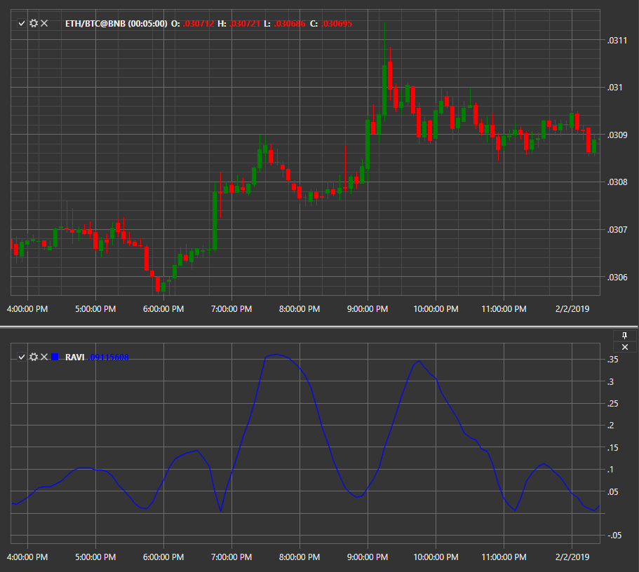

# 区间动作验证指数 (RAVI)

**区间动作验证指数 (RAVI)** 是一种技术分析指标，用于根据一对可自定义周期的简单移动平均线来确定市场中趋势的存在及其方向。

要使用该指标，必须使用 [RangeActionVerificationIndex](xref:StockSharp.Algo.Indicators.RangeActionVerificationIndex) 类。

## 推荐内容

[变化率 (RoC)](roc.md)
