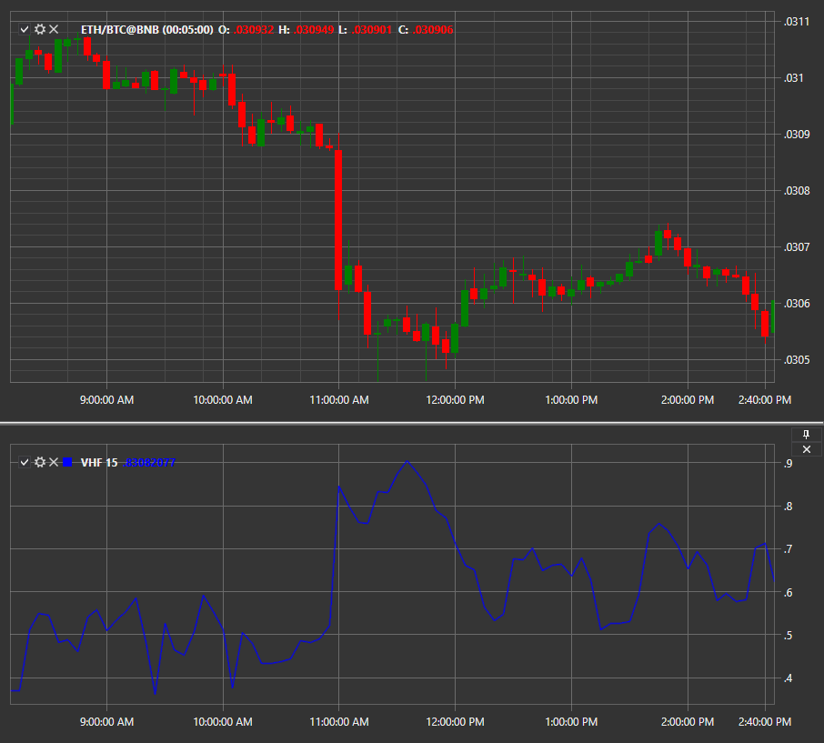

# VHF

**垂直水平滤波器（VHF）** - 垂直水平滤波器指标由Adam White于1991年开发。该指标在技术分析中用于识别价格处于趋势（上升趋势或下降趋势）时期，或者该指标处于过载阶段（横盘趋势）。

使用该指标，您必须使用 [VerticalHorizontalFilter](xref:StockSharp.Algo.Indicators.VerticalHorizontalFilter) 类。

## 推荐内容

[成交量](volume.md)
