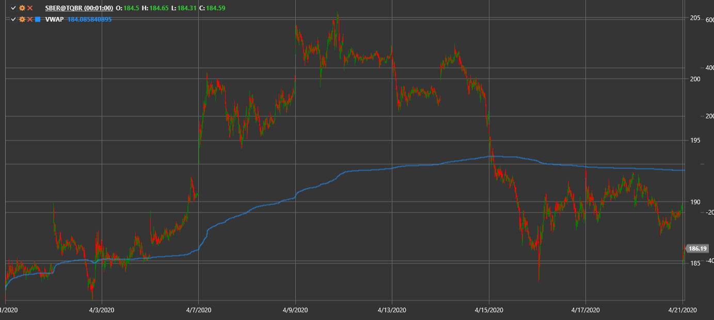

# 成交量加权平均价

**成交量加权平均价 (VWAP)** 显示按交易量加权的平均价格。

要使用该指标，您必须使用 [VolumeWeightedAveragePrice](xref:StockSharp.Algo.Indicators.VolumeWeightedAveragePrice) 类。

## 推荐内容

[时间加权平均价格](time_weighted_average_price.md)
