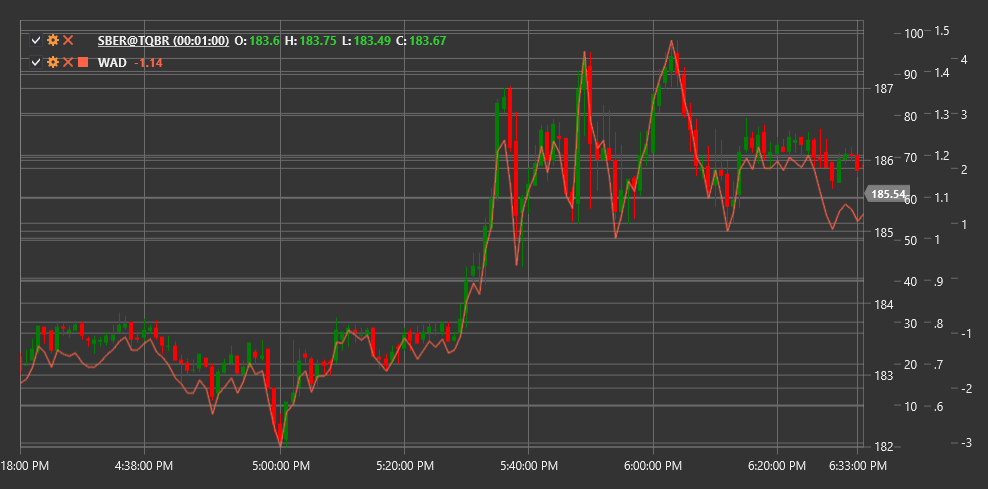

# WAD

**威廉累积/分配指标 (WAD)** 是由拉里·威廉姆斯（Larry Williams）开发的一个成交量指标。与传统的累积/分配线不同，WAD 指标关注当前周期收盘价与前一周期收盘价之间的关系，以确定买方或卖方的压力。

要使用该指标，需要使用 [WilliamsAccumulationDistribution](xref:StockSharp.Algo.Indicators.WilliamsAccumulationDistribution) 类。

## 描述

威廉累计/分配指标旨在识别价格与成交量之间的差异，这些差异可能预示潜在的趋势反转。WAD 对揭示当前价格走势的弱点特别有用。

WAD 的主要特征：
- 正值表示累积（买入压力）
- 负值表示分布（卖压）
- WAD与价格之间的背离可能先于价格反转

该指标的主要应用：
- 确认当前趋势
- 识别潜在的价格反转
- 确定买方或卖方压力

## 计算

威廉累积/派发指标的计算公式如下：

1. 确定当前期间的真实范围保护（TRP）:
   ```
   TRP = Max(High - Low, |High - Close_prev|, |Low - Close_prev|)
   ```

2. 计算当前期的积累/分配（AD）值：
   - 如果 收盘价 > 前一日收盘价（市场上涨）:
      ```
      AD = Close - Min(Low, Close_prev) 
      ```
   - 如果 收盘价 < 前一日收盘价（市场下跌）：
      ```
      AD = Close - Max(High, Close_prev)
      ```
   - 如果 Close = Close_prev:
      ```
      AD = 0
      ```

3. 通过累加 AD 值来计算 WAD 值：
   ```
   WAD = Previous WAD value + AD
   ```

该指标累积正值和负值，形成一条累积线，可用于与价格运动进行比较。



## 另请参阅

[ADL](accumulation_distribution_line.md)
[OBV](on_balance_volume.md)