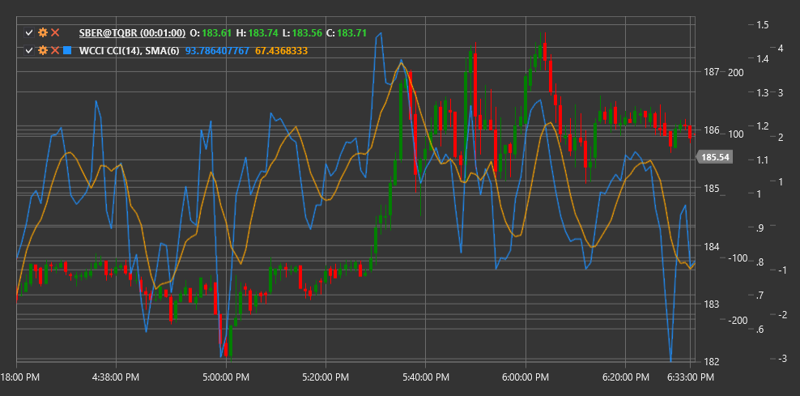

# WCCI

**Woodies CCI（WCCI）** 是标准商品通道指数（CCI）的一个变体，由交易员 Ken Wood（被称为“Woodies”）开发。这个 CCI 变体包括额外的平滑处理，并被用作完整的 Woodies CCI 交易系统的一部分。

要使用该指标，您需要使用 [WoodiesCCI](xref:StockSharp.Algo.Indicators.WoodiesCCI) 类。

## 描述

Woodies CCI 是经典 CCI 指标的修改版本，包括两条线：
- 主CCI线，选择的周期（通常为14）
- 平滑的CCI线，即主CCI线的简单移动平均线

Woodies CCI 系统使用这两条线以及几个关键水平来生成交易信号。主要水平包括：
- +100 和 -100（传统超买和超卖水平）
- +200 和 -200（强烈超买和超卖情况）
- 零线（对于趋势判断很重要）

Woodies CCI 系统中的关键信号：
- “零线反弹”——当CCI接近零线然后从零线上反弹，继续之前的方向
- “趋势线突破”——当CCI突破重要趋势线时
- “反向背离”——价格与CCI之间的一种特定类型的背离

## 参数

- **周期** - 主CCI线的计算周期（通常为14）
- **SMA周期** - 用于平滑主要CCI线以获得第二条线的周期（通常为9）

## 计算

Woodies CCI 的计算分为几个步骤进行：

1. 首先，计算标准CCI：
   ```
   典型价格 (TP) = (High + Low + Close) / 3
   平均值 (SMA) = SMA(TP, Length)
   平均偏差 (MD) = Sum(|TP - SMA|) / Length
   CCI = (TP - SMA) / (0.015 * MD)
   ```

2. 然后计算平滑的CCI线：
   ```
   Smooth CCI = SMA(CCI, SMALength)
   ```

Woodies CCI 使用这两条线的组合来生成交易信号。在经典的 Woodies 系统中，这些线的交叉、它们与关键水平的互动以及各种模式构成了交易决策的基础。



## 另请参阅

[CCI](cci.md)