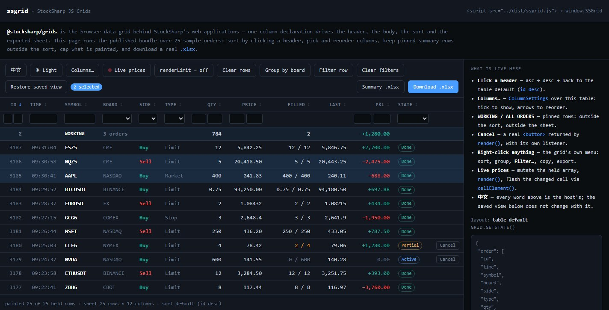

# JavaScript 表格

[StockSharp JS Grids](https://github.com/StockSharp/JS-Grids) 是一套用于显示表格数据的浏览器组件。该包以 [@stocksharp/grids](https://www.npmjs.com/package/@stocksharp/grids) 的名称发布在 npm 上，不依赖任何第三方运行时库，既可与 TypeScript 配合使用，也可直接在浏览器中使用。



可在[在线演示](https://stocksharp.github.io/JS-Grids/demo/)中试用现成版本：单击表头可对行进行排序，列可以拖动和隐藏，筛选与分组会改变显示结果，导出功能则会生成真正的 `.xlsx` 文件。

## 包含的组件

- [DataGrid](grids/data_grid.md) 根据统一的列定义生成表头和数据行。它负责排序、筛选、分组、行选择、固定汇总行、上下文菜单、状态保存和导出。
- [ColumnSettings](grids/column_settings.md) 可接入服务器已经渲染好的 HTML 表格，让用户调整列的顺序和可见性。
- [TableSort](grids/table_sort.md) 为由应用程序管理的表格提供独立的排序控制器。
- [TableExport](grids/table_export.md) 无需第三方库即可生成 OOXML `.xlsx` 工作簿。

`DataGrid` 和 `ColumnSettings` 解决的问题不同。前者根据列声明自行创建 `<thead>` 和 `<tbody>` 的内容。后者不会创建表格，仅用于带有 `data-col` 属性的现有服务器端标记。

## 安装

从 npm 安装该包：

```bash
npm install @stocksharp/grids
```

所有主要组件均可从统一入口导入：

```ts
import {
  DataGrid,
  ColumnSettings,
  TableSort,
  TableExport,
} from '@stocksharp/grids';
```

若要减少导入的代码量，可以使用单独的入口：

```ts
import { DataGrid } from '@stocksharp/grids/data-grid';
import { ColumnSettings } from '@stocksharp/grids/column-settings';
import { TableSort } from '@stocksharp/grids/table-sort';
import { TableExport } from '@stocksharp/grids/table-export';
```

不使用打包工具时，可引入预构建的浏览器包。其公共对象位于 `window.SSGrid`：

```html
<script src="https://cdn.jsdelivr.net/npm/@stocksharp/grids@1.1.0/dist/ssgrid.js"></script>
<script>
  const { DataGrid, TableExport } = window.SSGrid;
</script>
```

## 快速示例

先准备一个包含表头区和数据区的普通表格：

```html
<table id="orders">
  <thead></thead>
  <tbody></tbody>
</table>
```

只需定义一次列，然后将数据行传给表格：

```ts
import { DataGrid, SortDirections } from '@stocksharp/grids';

interface Order {
  id: number;
  symbol: string;
  price: number;
}

const table = document.querySelector<HTMLTableElement>('#orders')!;
const grid = new DataGrid<Order>({
  head: table.tHead!,
  body: table.tBodies[0],
  columns: [
    { key: 'id', header: '编号', value: order => order.id, filter: 'number', exportable: true },
    { key: 'symbol', header: '交易品种', value: order => order.symbol, filter: 'text', exportable: true },
    { key: 'price', header: '价格', value: order => order.price, filter: 'number', exportable: true },
  ],
  defaultSort: { col: 'id', dir: SortDirections.Desc },
  rowKey: order => String(order.id),
  emptyText: '暂无订单',
  locale: 'zh-CN',
});

grid.setRows([
  { id: 101, symbol: 'SBER', price: 312.45 },
  { id: 102, symbol: 'GAZP', price: 164.18 },
]);
```

该库会创建 DOM 元素，但不会强制使用特定外观。颜色、尺寸、行高亮、菜单、筛选对话框和辅助类均由应用程序的样式表定义。

## 从源代码构建

仓库和本地演示使用标准 npm 命令：

```bash
git clone https://github.com/StockSharp/JS-Grids.git
cd JS-Grids
npm ci
npm test
npm run build
npm run serve
```

启动后，可通过 `http://localhost:8793/demo/` 访问演示。

## 另请参阅

- [JS-Grids 仓库](https://github.com/StockSharp/JS-Grids)
- [@stocksharp/grids 包](https://www.npmjs.com/package/@stocksharp/grids)
- [在线演示](https://stocksharp.github.io/JS-Grids/demo/)
- [JavaScript 交易控件](trading_controls.md)
- [JavaScript 图表](charts.md)
- [JavaScript 框图](diagram.md)
