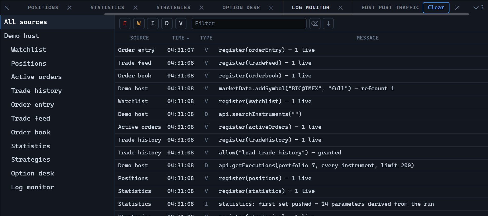

# 日志

`LogMonitorWidget` 显示运行日志：左侧是来源树，右侧是所选来源及其整个子树的消息表格。每条消息只存储一次，并带有写入它的来源的标识符，同时保存的行数是有上限的。



## 创建和更新

```ts
import {
  LogLevels,
  LogMonitorWidget,
  type TradingHost,
} from '@stocksharp/trading-controls';

declare const host: TradingHost;

const log = LogMonitorWidget.create(
  document.querySelector<HTMLElement>('#log')!,
  {},
  {
    host,
    maxMessages: 20_000,
  },
);

log.setSources([
  { id: 'connector', name: 'Connector' },
  { id: 'strategy-1', name: 'SMA', parentId: 'connector' },
]);

log.append([{
  id: 1,
  time: Date.now(),
  level: LogLevels.Warning,
  sourceId: 'strategy-1',
  message: '订单被拒绝：资金不足',
}]);

log.select('connector');
```

依赖中只有 `host` 是必填的：日志是被写入的，而不是据以执行动作的，因此控件不需要任何处理器。其余依赖都是可选的：

| 依赖 | 默认值 | 用途 |
|---|---|---|
| `maxMessages` | `5000` | 保存多少条消息。超出的部分从列表开头丢弃。 |
| `chrome` | `true` | 是否绘制自带的、带关闭按钮的标题栏。如果宿主自己为面板添加标题并负责关闭（例如通过停靠标签页），则传入 `false`。 |
| `sources` | `true` | 创建时是否显示来源树。这只是初始状态：可以通过表格上下文菜单或调用 `showSources` 让树重新出现。 |

`setSources` 整体传入来源列表：消失的来源会从树中移除，此时选择会重置为“全部来源”。`append` 只追加刚刚记录的内容，`clear` 会忘记所有消息，同时保留来源树。

静态属性 `LogMonitorWidget.TYPE` 包含控件标识符 `logMonitor`。

## 来源与筛选

来源声明的是自己的父节点（`parentId`），而不是子节点，并且可以早于父节点出现。树是用已经到达的数据构建的：父节点未知的来源成为根节点，环在第一个节点处断开。树的行是扁平的，层级通过缩进表示；最上面一行一次选中全部来源。

同时生效的筛选有三个：启用的级别集合、按消息文本的搜索字符串（不区分大小写）以及所选的来源子树。级别通过工具栏按钮切换——`LogLevels` 对象中的 `error`、`warning`、`info`、`debug`、`verbose`；在较窄的列中，级别以字母 `E`、`W`、`I`、`D`、`V` 显示。方法 `visible` 返回经过全部筛选后剩下的内容。

表格由来源、时间、级别和消息几列组成，按时间升序排序，并支持多行选择、排序、隐藏列、筛选和上下文菜单。菜单中增加了显示来源树的选项。工具栏按钮把可见行导出为 XLSX；导出内容中包含由 `host.presentation.timeText` 格式化的时间，以及级别的完整名称而不是字母。

## 宿主做什么

控件从宿主获取翻译（`host.t`）、时间格式（`host.presentation.timeText`）和面板关闭处理（`host.close`），并通过 `host.register` 注册、在 `dispose` 中注销。它不在 `host.preferences` 中保存自己的设置，也不保存实例状态：`create` 的第二个参数只是为了保持一致而接收，但并不会被读取。消息的收集、投递以及面板位置的恢复都由宿主负责。

## 公共方法

- `setSources(sources)` — 替换来源列表。
- `append(messages)` — 在遵守 `maxMessages` 限制的前提下追加消息。
- `clear()` — 清空消息。
- `select(sourceId)` — 显示某个来源的子树；`null` 表示显示全部。
- `visible()` — 经过全部筛选后剩下的消息。
- `sourcesShown()` — 来源树当前是否显示。
- `showSources(on)` — 显示或隐藏来源树；此时已选中的来源筛选会保留。
- `dispose()` — 释放资源。

## 另请参阅

- [JavaScript 交易控件](../trading_controls.md)
- [策略](strategies.md)
- [统计](statistics.md)
