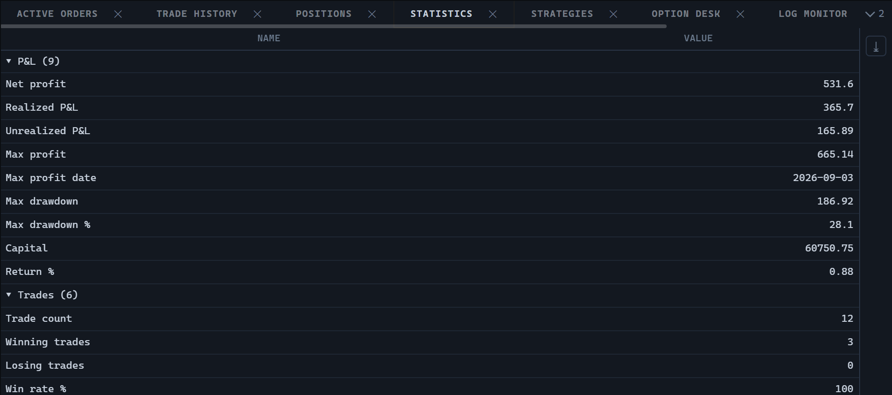

# 统计

`StatisticsWidget` 是策略统计参数的表格：盈利、回撤、成交笔数、延迟。该面板只读：每个参数一行，各行按其所属的领域分组。



## 创建和更新

```ts
import {
  StatisticsWidget,
  type TradingHost,
} from '@stocksharp/trading-controls';

declare const host: TradingHost;

const statistics = StatisticsWidget.create(
  document.querySelector<HTMLElement>('#statistics')!,
  {},
  { host },
);

statistics.update([
  {
    key: 'NetProfit',
    category: 'pnl',
    categoryText: '盈利',
    order: 1,
    name: '净利润',
    description: '本次运行的结果',
    value: 11_055.75,
  },
  {
    key: 'MaxProfitDate',
    category: 'pnl',
    categoryText: '盈利',
    order: 2,
    name: '最大值日期',
    value: '2024-03-26T07:30:00Z',
  },
  {
    key: 'NetProfit',
    category: 'pnl',
    categoryText: '成交',
    order: 100,
    name: '成交笔数',
    value: 1_340,
  },
]);
```

依赖集合 `StatisticsDeps` 只包含一个必填字段 `host`。控件没有任何操作处理器：统计数据由策略生成，面板中没有什么可撤销、可重新加载或可编辑的内容。`create` 的第二个参数是面板的已保存状态；控件并不使用它。

`update` 会整体替换全部数据行。策略把自己的参数作为一张表发布，因此从集合中消失的行被视为不再存在，而不是不再变化。行的标识由 `key` 字段确定。

## 数据行与顺序

数据行由 `StatisticRow` 类型描述：

| 字段 | 用途 |
|---|---|
| `key` | 参数的稳定标识符。 |
| `category` | 与语言无关的分组键。 |
| `categoryText` | 用于显示的分组标题。缺失时使用 `category`。 |
| `order` | 参数在注册表中的位置。 |
| `name` | 已本地化的参数名称。 |
| `description` | 已本地化的说明，在名称单元格上以工具提示显示。 |
| `value` | 数字、日期或字符串。`null` 表示该参数尚未被测量。 |

桌面版表格通过反射从策略参数中获取数据行；浏览器中没有这种机制，因此数据行由宿主直接提供，其名称和说明已经翻译好。

分组按 `category` 进行，而不是按 `categoryText`：按已翻译的标题分组会导致切换语言时表格重建。分组的顺序由组内参数的最小 `order` 决定，因此盈利排在回撤之上，回撤又排在成交计数之上。按名称或按数值排序会把本应一起阅读的参数拆散。

可见列有两个：`Name` 和 `Value`。`category` 和 `order` 列虽已声明但被隐藏——它们用于分组和排序，对读者没有任何意义。导出时只包含这两个可见列。

## 数值格式化

数值单元格的文本由导出的函数 `formatStatistic(value)` 生成：

```ts
import { formatStatistic } from '@stocksharp/trading-controls';

formatStatistic(11_055.756); // '11055.76'
formatStatistic(1_340);      // '1340'
formatStatistic('2024-03-26T07:30:00Z'); // '2024-03-26'
formatStatistic(null);       // ''
```

数字四舍五入到两位小数，并去掉末尾的零。日期只显示到天：这类参数描述的是整次运行，其中的时间只会成为噪声。字符串只有以 `YYYY-MM-DD` 开头时才会被识别为日期；否则它仍是文本。缺失的值给出空单元格，而不是零——零会被读成一个已测量的结果。

排序按原始值进行，因此数字按数字排序，而不是按字符串排序。

## 控件做什么，宿主做什么

控件通过 `host.t` 从宿主获取全部可见文本，包括列标题、面板标题、空表提示以及表格上下文菜单的各项。关闭按钮调用 `host.close`，导出会把表格输出为 XLSX。创建时实例通过 `host.register` 注册，`dispose` 时通过 `host.unregister` 注销。

控件不在 `host.preferences` 中保存自己的设置。它也不请求数据：数据行由宿主通过 `update` 调用提供。

面板类型标识符可通过 `StatisticsWidget.TYPE` 获取，其值为 `ControlTypes.Statistics`。

## 公共方法

- `StatisticsWidget.create(hostEl, state, deps)` — 在指定容器中创建面板。
- `update(rows)` — 替换全部统计数据行。
- `dispose()` — 释放资源。

该面板还支持排序、多行选择、上下文菜单以及导出为 XLSX。

## 另请参阅

- [JavaScript 交易控件](../trading_controls.md)
- [持仓](positions.md)
- [成交历史](trade_history.md)
- [活动订单](active_orders.md)
