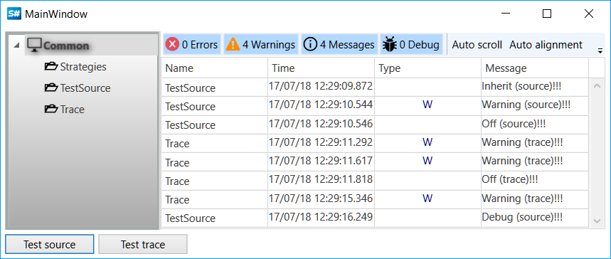

# 其他日志来源

在之前的主题中，嵌入在 [S\#](../../api.md) 类中的对象是日志的来源。 [S\#](../../api.md) 为日志来源是您自己的类的情况，或者日志来源不必与特定类关联但服务于整个应用程序的情况提供了可能性。对于第一种情况，您必须在您的类中实现 [ILogSource](xref:Ecng.Logging.ILogSource) 接口或继承自 [BaseLogReceiver](xref:Ecng.Logging.BaseLogReceiver)。在第二种情况下，您可以使用 [TraceSource](xref:Ecng.Logging.TraceSource)，它使用 .NET 跟踪系统。如何操作请参见 *Samples\/08_Misc\/01_Logging* 示例。

## 记录样本

1. 创建一个继承自 [BaseLogReceiver](xref:Ecng.Logging.BaseLogReceiver) 的自定义类。

   ```cs
   private class TestSource : BaseLogReceiver
   {
   }
   ```
2. 创建 [LogManager](xref:Ecng.Logging.LogManager) 并声明一个用户类的变量。

   ```cs
   private readonly LogManager _logManager = new LogManager();
   private readonly TestSource _testSource;
   				
   ```
3. 添加日志来源。

   ```cs
   _logManager.Sources.Add(_testSource = new TestSource());
   _logManager.Sources.Add(new Ecng.Logging.TraceSource());
   				
   ```
4. 添加日志监听器。

   ```cs
   // log messages will be displayed in GUI component
   _logManager.Listeners.Add(new GuiLogListener(Monitor));
   // also writing in files
   _logManager.Listeners.Add(new FileLogListener
   {
   	FileName = "logs",
   });
   				
   ```
5. 添加自定义类日志的消息。日志级别是随机选择的。

   ```cs
   var level = RandomGen.GetEnum<LogLevels>();
   switch (level)
   {
   	case LogLevels.Inherit:
   	case LogLevels.Debug:
   	case LogLevels.Info:
   	case LogLevels.Off:
   		_testSource.AddInfoLog("{0} (source)!!!".Put(level));
   		break;
   	case LogLevels.Warning:
   		_testSource.AddWarningLog("Warning (source)!!!");
   		break;
   	case LogLevels.Error:
   		_testSource.AddErrorLog("Error (source)!!!");
   		break;
   	default:
   		throw new ArgumentOutOfRangeException();
   }
   ```
6. 添加跟踪消息。

   ```cs
   var level = RandomGen.GetEnum<LogLevels>();
   switch (level)
   {
   	case LogLevels.Inherit:
   	case LogLevels.Debug:
   	case LogLevels.Info:
   	case LogLevels.Off:
   		Trace.TraceInformation("{0} (trace)!!!".Put(level));
   		break;
   	case LogLevels.Warning:
   		Trace.TraceWarning("Warning (trace)!!!");
   		break;
   	case LogLevels.Error:
   		Trace.TraceError("Error (trace)!!!");
   		break;
   	default:
   		throw new ArgumentOutOfRangeException();
   }
   ```
7. 示例工作的结果。
