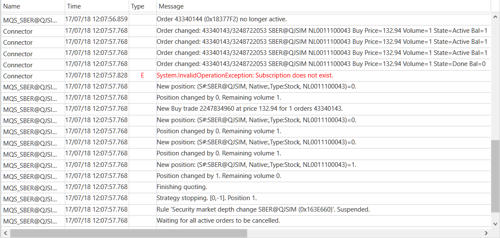

# 策略记录

[Strategy](xref:StockSharp.Algo.Strategies.Strategy) 类实现了 [ILogSource](xref:Ecng.Logging.ILogSource) 接口。因此，这些策略可以传递给 [LogManager.Sources](xref:Ecng.Logging.LogManager.Sources)，其所有消息将自动发送到 [LogManager.Listeners](xref:Ecng.Logging.LogManager.Listeners)。

## 先决条件

[交易策略](../strategies.md)

## 记录到测试文件

1. 首先，您需要创建特殊的管理器：

   ```cs
   var logManager = new LogManager();
   ```
2. 然后你需要创建一个文件记录器，将文件名传递给它，并将其添加到 [LogManager.Listeners](xref:Ecng.Logging.LogManager.Listeners)：

   ```cs
   var fileListener = new FileLogListener("{0}_{1:00}_{2:00}.txt".Put(DateTime.Now.Year, DateTime.Now.Month, DateTime.Now.Day));
   logManager.Listeners.Add(fileListener);
   ```
3. 对于记录消息，你需要向 [LogManager.Sources](xref:Ecng.Logging.LogManager.Sources) 添加一个策略：

   ```cs
   logManager.Sources.Add(lkohSmaStrategy);
   ```
4. 在将策略添加到日志管理器后，它的所有消息都将被记录到文件中。

## 声音播放

1. 创建一个记录器并将声音文件的名称传递给它：

   ```cs
   var soundListener = new SoundLogListener("error.mp3");
   						
   logManager.Listeners.Add(soundListener);
   logManager.Sources.Add(lkohSmaStrategy);
   ```
2. 将滤镜设置为仅当消息类型为 [LogLevels.Error](xref:Ecng.Logging.LogLevels.Error) 时播放声音：

   ```cs
   soundListener.Filters.Add(msg => msg.Level == LogLevels.Error);
   ```

## 发送邮件

1. 创建日志记录器并将已发送邮件的参数传递给它：

   ```cs
   var emailListener = new EmailLogListener("from@stocksharp.com", "to@stocksharp.com");
   logManager.Listeners.Add(emailListener);
   logManager.Sources.Add(lkohSmaStrategy);
   ```
2. 设置发送类型为 [LogLevels.Error](xref:Ecng.Logging.LogLevels.Error) 和 [LogLevels.Warning](xref:Ecng.Logging.LogLevels.Warning) 消息的过滤器：

   ```cs
   emailListener.Filters.Add(msg => msg.Level == LogLevels.Error);
   emailListener.Filters.Add(msg => msg.Level == LogLevels.Warning);
   ```

## 正在登录日志窗口

1. 创建 [GuiLogListener](xref:StockSharp.Xaml.GuiLogListener) 日志记录器：

   ```cs
    // each strategy will have their own windows
   var guiListener = new GuiLogListener();
   logManager.Listeners.Add(guiListener);
   logManager.Sources.Add(lkohSmaStrategy);
   ```
2. 这是策略运行时的日志窗口： 

## 推荐内容

[可视化日志组件](../graphical_user_interface/logging.md)
