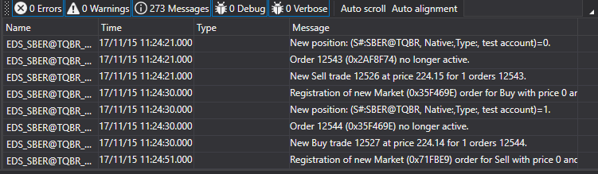

# 视觉监控

为了简化监控，您可以使用特殊的 [Monitor](xref:StockSharp.Xaml.Monitor) 组件。另请参见 [可视化日志组件](../graphical_user_interface/logging.md)。



此窗口允许您显示来自所有 [ILogSource](xref:Ecng.Logging.ILogSource) 的消息：

- 策略 ([Strategy](xref:StockSharp.Algo.Strategies.Strategy));
- 连接器 ([IConnector](xref:StockSharp.BusinessEntities.IConnector));
- 拥有 [ILogSource](xref:Ecng.Logging.ILogSource) 实现（例如，算法中的主窗口）。

来源的嵌套以树的形式显示。每个父节点包含来自所有嵌套来源的信息，依次直到最低级别。对于连接器来说，当使用 [BasketTrader](../connectors.md) 时，这也是有用的。同样，通过实现 [ILogSource.Parent](xref:Ecng.Logging.ILogSource.Parent) 属性，也可以为您自己的算法安排相同的嵌套。

## 使用显示器

1. 首先，您需要创建一个窗口并添加组件。
2. 然后，创建的窗口必须通过 [GuiLogListener](xref:StockSharp.Xaml.GuiLogListener) 添加到你的 [LogManager](xref:Ecng.Logging.LogManager) 中：

   ```cs
   _logManager.Listeners.Add(new GuiLogListener(monitor));
   ```
3. 此后，所有来源 [LogManager.Sources](xref:Ecng.Logging.LogManager.Sources)（策略、连接器等）将向 [Monitor](xref:StockSharp.Xaml.Monitor) 发送消息。

## 推荐内容

[可视化日志组件](../graphical_user_interface/logging.md)
